<div align="center">

# VMWARE WORKSTATION PRO

### Informe Técnico — Configuración de Red en Máquinas Virtuales

**Juan Esteban Moreno Gamboa**<br>
**Fredy Oswaldo López Daza**<br>

**Docente:** Frey Alfonso Santamaría Buitrago — Ingeniero de Sistemas

**Universidad Pedagógica y Tecnológica de Colombia**<br>
Facultad de Ingeniería — Escuela de Ingeniería de Sistemas y Computación<br>
Electiva IaaS y Virtualización<br>
Tunja, 2026

</div>

---

## TABLA DE CONTENIDOS

- [LISTA DE FIGURAS](#lista-de-figuras)
- [INTRODUCCIÓN](#introducción)
- [1. Preparación del Entorno](#1-preparación-del-entorno)
  - [1.1. Verificación de requisitos del sistema anfitrión](#11-verificación-de-requisitos-del-sistema-anfitrión)
  - [1.2. Descarga e instalación de VMware Workstation Pro](#12-descarga-e-instalación-de-vmware-workstation-pro)
  - [1.3. Primera ejecución y reconocimiento de la interfaz](#13-primera-ejecución-y-reconocimiento-de-la-interfaz)
- [2. Creación de la Máquina Virtual con Ubuntu MATE](#2-creación-de-la-máquina-virtual-con-ubuntu-mate)
  - [2.1. Descarga de la imagen ISO de Ubuntu MATE](#21-descarga-de-la-imagen-iso-de-ubuntu-mate)
  - [2.2. Asistente de nueva máquina virtual](#22-asistente-de-nueva-máquina-virtual)
  - [2.3. Configuración de hardware virtual: CPU, memoria y disco](#23-configuración-de-hardware-virtual-cpu-memoria-y-disco)
  - [2.4. Instalación del sistema operativo invitado](#24-instalación-del-sistema-operativo-invitado)
  - [2.5. Instalación de VMware Tools en Ubuntu MATE](#25-instalación-de-vmware-tools-en-ubuntu-mate)
- [3. Exploración del Virtual Network Editor](#3-exploración-del-virtual-network-editor)
  - [3.1. Acceso y reconocimiento de los conmutadores predeterminados](#31-acceso-y-reconocimiento-de-los-conmutadores-predeterminados)
  - [3.2. Identificación de los adaptadores VMnet1 y VMnet8 en Windows](#32-identificación-de-los-adaptadores-vmnet1-y-vmnet8-en-windows)
- [4. Configuración de Red en Modo NAT](#4-configuración-de-red-en-modo-nat)
  - [4.1. Asignación del modo NAT al adaptador de red de la VM](#41-asignación-del-modo-nat-al-adaptador-de-red-de-la-vm)
  - [4.2. Verificación de la dirección IP asignada por DHCP](#42-verificación-de-la-dirección-ip-asignada-por-dhcp)
  - [4.3. Prueba de conectividad hacia Internet](#43-prueba-de-conectividad-hacia-internet)
- [5. Configuración de Red en Modo Host-Only con IP Estática](#5-configuración-de-red-en-modo-host-only-con-ip-estática)
  - [5.1. Asignación del modo Host-Only al adaptador de red](#51-asignación-del-modo-host-only-al-adaptador-de-red)
  - [5.2. Configuración de dirección IP estática con nmcli](#52-configuración-de-dirección-ip-estática-con-nmcli)
  - [5.3. Verificación de conectividad con el sistema anfitrión](#53-verificación-de-conectividad-con-el-sistema-anfitrión)
- [6. Configuración de Red en Modo Bridged](#6-configuración-de-red-en-modo-bridged)
  - [6.1. Asignación del modo Bridged al adaptador de red](#61-asignación-del-modo-bridged-al-adaptador-de-red)
  - [6.2. Obtención de dirección IP de la red física](#62-obtención-de-dirección-ip-de-la-red-física)
  - [6.3. Verificación de conectividad con equipos de la red local](#63-verificación-de-conectividad-con-equipos-de-la-red-local)
- [7. Comunicación entre Dos Máquinas Virtuales](#7-comunicación-entre-dos-máquinas-virtuales)
  - [7.1. Clonación completa de la VM base](#71-clonación-completa-de-la-vm-base)
  - [7.2. Configuración de IPs en las Maquinas Virtuales y conectividad](#72-configuración-de-ips-en-las-maquinas-virtuales-y-conectividad)
    - [7.2.1. Primer método - Modo Host-Only](#721-primer-método---modo-host-only)
    - [7.2.2. Segundo método - Modo Bridge](#722-segundo-método---modo-bridge)
- [8. Instantáneas y Gestión del Estado de la VM](#8-instantáneas-y-gestión-del-estado-de-la-vm)
  - [8.1. Creación de un snapshot antes de modificar la configuración de red](#81-creación-de-un-snapshot-antes-de-modificar-la-configuración-de-red)
  - [8.2. Restauración del snapshot](#82-restauración-del-snapshot)
- [9. Monitoreo de Actividad de Red](#9-monitoreo-de-actividad-de-red)
- [10. Tabla Resumen de Resultados](#10-tabla-resumen-de-resultados)
- [CONCLUSIONES](#conclusiones)
- [REFERENCIAS](#referencias)

---

## LISTA DE FIGURAS

| Figura | Descripción |
|--------|-------------|
| Fg. 1  | Verificación de la virtualización habilitada en el Administrador de Tareas de Windows |
| Fg. 2  | Descarga del instalador de VMware Workstation Pro desde el portal de Broadcom |
| Fg. 3  | Interfaz principal de VMware Workstation Pro tras la instalación |
| Fg. 4  | Asistente de nueva VM — selección de la imagen ISO de Ubuntu MATE |
| Fg. 5  | Editor de hardware virtual — configuración de CPU, memoria y disco |
| Fg. 6  | Pantalla de instalación de Ubuntu MATE dentro de la VM |
| Fg. 7  | Instalación de VMware Tools en Ubuntu MATE — terminal con comandos |
| Fg. 8  | Virtual Network Editor — conmutadores VMnet0, VMnet1 y VMnet8 |
| Fg. 9  | Adaptadores VMnet1 y VMnet8 visibles en las conexiones de red de Windows |
| Fg. 10 | Editor de hardware virtual — adaptador de red configurado en modo NAT |
| Fg. 11 | Terminal de Ubuntu MATE — resultado de `ip addr show` en modo NAT |
| Fg. 12 | Terminal de Ubuntu MATE — `ping 8.8.8.8` exitoso en modo NAT |
| Fg. 13 | Editor de hardware virtual — adaptador de red configurado en modo Host-Only |
| Fg. 14 | Terminal de Ubuntu MATE — configuración de IP estática con `nmcli` |
| Fg. 15 | Terminal de Ubuntu MATE — `ping` desde la VM hacia el anfitrión (VMnet1) |
| Fg. 16 | Editor de hardware virtual — adaptador de red configurado en modo Bridged |
| Fg. 17 | Terminal de Ubuntu MATE — dirección IP asignada en modo Bridged |
| Fg. 18 | Terminal de Ubuntu MATE — `ping` hacia otro equipo de la red local física |
| Fg. 19 | Clonación completa de VM1 para generar VM2 |
| Fg. 20 | Terminal de VM1 — `ping` exitoso hacia VM2 con respuestas recibidas |
| Fg. 21 | Snapshot Manager — instantánea creada antes de la práctica de red |

---

## INTRODUCCIÓN

El presente informe documenta el desarrollo del laboratorio práctico sobre configuración de red en máquinas virtuales utilizando VMware Workstation Pro como plataforma de virtualización. El objetivo central de la práctica es demostrar los distintos modos de conectividad de red que ofrece la herramienta —NAT, Host-Only y Bridged— y su aplicación para lograr comunicación entre máquinas virtuales y con equipos de la red física del laboratorio.

Esta práctica se enmarca en el proyecto integrador de la electiva de Infraestructura como Servicio (IaaS) y Virtualización, en el que distintos grupos trabajan con diferentes plataformas de virtualización con el objetivo común de interconectar sus máquinas virtuales. El conocimiento de la configuración de red en VMware Workstation Pro resulta, por tanto, no solo relevante en sí mismo, sino directamente necesario para la integración con las instancias gestionadas por otros grupos mediante hipervisores de Tipo 1 como Proxmox Virtual Environment.

El laboratorio se realizó sobre equipos de escritorio con sistema operativo Windows y VMware Workstation Pro versión 17, desplegando máquinas virtuales con el sistema operativo Ubuntu MATE por su ligereza y compatibilidad con los recursos de hardware disponibles. El informe describe de forma secuencial cada procedimiento realizado, acompañado de las capturas de pantalla correspondientes que evidencian el resultado de cada configuración.

---

## 1. Preparación del Entorno

### 1.1. Verificación de requisitos del sistema anfitrión

Antes de proceder con la instalación de VMware Workstation Pro, se verificó que el equipo anfitrión cumplía con los requisitos mínimos de hardware descritos en el marco teórico, con especial atención al estado de las extensiones de virtualización asistida por hardware del procesador. Esta verificación se realizó a través del Administrador de Tareas de Windows (`Ctrl+Shift+Esc`), navegando a la pestaña *Rendimiento → CPU*, donde el campo *Virtualización* debe aparecer como *Habilitada* para confirmar que las extensiones Intel VT-x o AMD-V están activas en la configuración BIOS/UEFI del equipo.

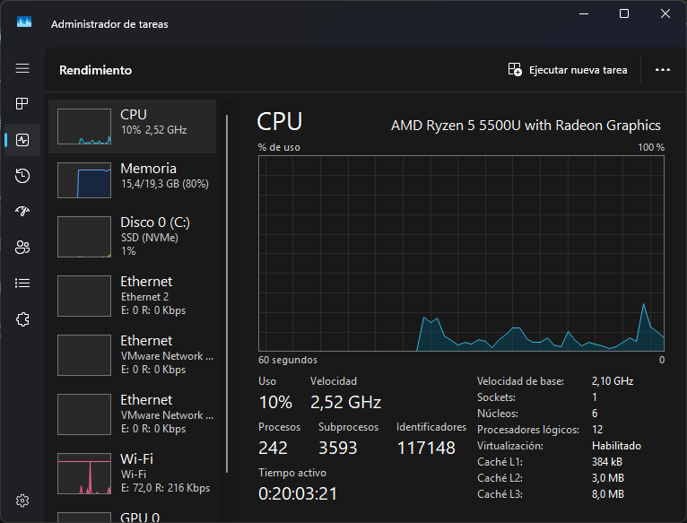
*Figura 1: Captura del Administrador de Tareas mostrando la CPU del equipo con el campo "Virtualización: Habilitada".*

Los resultados de la verificación del equipo utilizado en el laboratorio fueron los siguientes: [**completar con los datos reales del equipo: modelo de procesador, RAM total disponible, espacio en disco libre y versión de Windows**].

### 1.2. Descarga e instalación de VMware Workstation Pro

El instalador de VMware Workstation Pro se descargó desde el portal oficial de Broadcom, al cual se accede creando una cuenta gratuita en https://www.broadcom.com. Una vez en el portal, se navega a la sección de descargas de VMware y se selecciona la última versión disponible de VMware Workstation Pro para Windows. El archivo descargado es un ejecutable (.exe) de aproximadamente 277 MB.

La instalación se inició ejecutando el instalador con privilegios de administrador. El asistente de instalación presentó las opciones de ruta de instalación, ubicación de las máquinas virtuales y teclas de acceso rápido para la integración del teclado, que se dejaron con sus valores predeterminados. Al finalizar, el sistema requirió un reinicio para completar la carga de los módulos del kernel de VMware (vmmon y vmnet).

### 1.3. Primera ejecución y reconocimiento de la interfaz

Tras el reinicio, VMware Workstation Pro se abrió por primera vez. La aplicación solicitó seleccionar entre el modo de uso personal (gratuito) o comercial (requiere licencia); se seleccionó uso personal. La interfaz principal presentó la biblioteca de máquinas virtuales vacía en el panel izquierdo y la pantalla de inicio en el panel central, con los accesos directos para crear una nueva VM o abrir una existente.

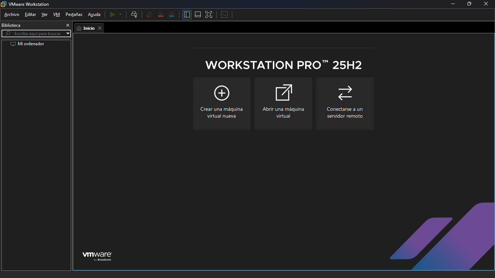
*Figura 3: Captura de la interfaz principal de VMware Workstation Pro en su primer arranque, mostrando la biblioteca vacía y la pantalla de inicio.*

---

## 2. Creación de la Máquina Virtual con Ubuntu MATE

### 2.1. Descarga de la imagen ISO de Ubuntu MATE

La imagen ISO de Ubuntu MATE se descargó desde el sitio oficial de la distribución en https://ubuntu-mate.org/download/. Se seleccionó la versión [**completar: por ejemplo, Ubuntu MATE 22.04.3 LTS**] para la arquitectura amd64 (64 bits). El archivo ISO tiene un tamaño aproximado de 3,7 GB y se almacenó en el directorio de descargas del equipo anfitrión para que VMware pudiera acceder a él durante el asistente de creación de la VM.

### 2.2. Asistente de nueva máquina virtual

La creación de la nueva máquina virtual se inició desde el menú *File → New Virtual Machine* de VMware Workstation Pro. Se seleccionó la opción de configuración típica (*Typical*). En la pantalla de origen de instalación, se eligió *Installer disc image file (iso)* y se navegó hasta la ubicación del archivo ISO de Ubuntu MATE descargado anteriormente. VMware Workstation detectó automáticamente el tipo de sistema operativo como *Ubuntu 64-bit* y ofreció la opción de instalación simplificada (*Easy Install*), que se utilizó para automatizar el proceso de instalación del sistema operativo.

Se configuraron los siguientes parámetros durante el asistente:

- **Nombre de la máquina virtual**
- **Nombre de usuario del sistema invitado**
- **Contraseña**
- **Ubicación de almacenamiento de la VM** ruta predeterminada en el directorio de VMs de VMware

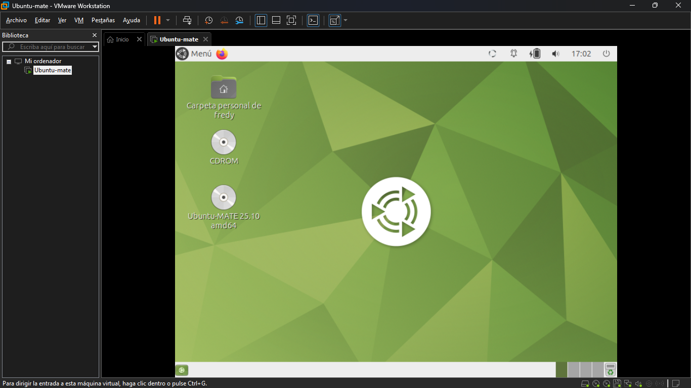
*Figura 4: Captura del asistente de nueva VM y selección de la imagen ISO de Ubuntu MATE.*

### 2.3. Configuración de hardware virtual: CPU, memoria y disco

Antes de finalizar el asistente, se revisó y ajustó la configuración de hardware virtual propuesta por VMware mediante el botón *Customize Hardware*. Los parámetros configurados fueron los siguientes:

- **Procesadores:** 2 CPU virtuales (1 procesador × 2 núcleos)
- **Memoria RAM:** 4096 MB (4 GB)
- **Disco duro virtual:** 20 GB, tipo dinámico (pre-allocated desactivado)
- **Adaptador de red:** NAT (configuración inicial; se modificará a lo largo del laboratorio)

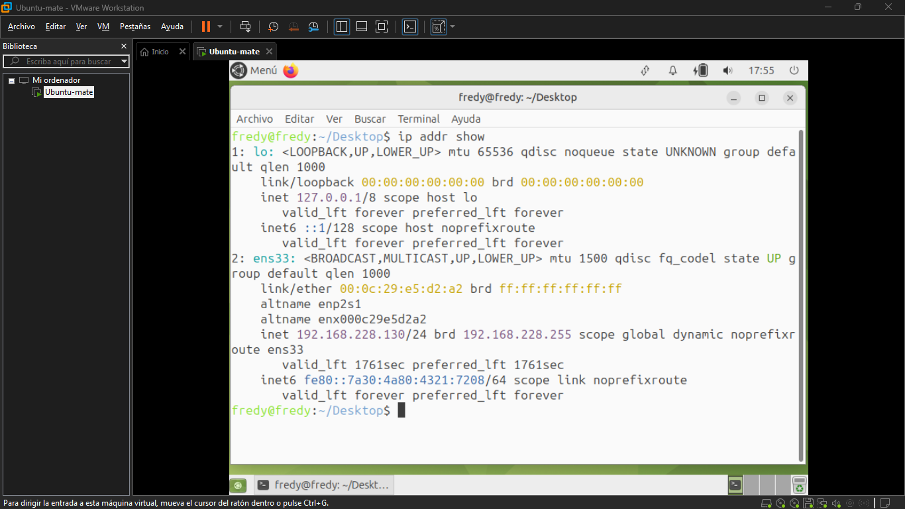
*Figura 5: Captura del editor de hardware virtual con la configuración de CPU, memoria y disco antes de iniciar la instalación.*

### 2.4. Instalación del sistema operativo invitado

Al finalizar el asistente y hacer clic en *Finish*, VMware Workstation Pro arrancó automáticamente la VM e inició el proceso de instalación de Ubuntu MATE mediante Easy Install. El proceso de instalación tomó aproximadamente 15 minutos y no requirió interacción del usuario, dado que los parámetros de nombre de usuario, contraseña y nombre del equipo habían sido configurados en el asistente. Al concluir, la VM se reinició automáticamente y presentó el escritorio de Ubuntu MATE listo para usar.

> *Nota: En uno de los equipos en los que se instalo vmware y luego ubuntu-mate, se presento un error, el cual marcaba el siguiente código: **VERIFY bora\mks\backends\vulkan\vkrSwapchain.c:371** después de consultar se pudo solucionar agregando esta linea `mks.enableVulkanPresentation=FALSE` dentro del archivo de ` .vmx` de la maquina virtual, según lo investigado es un error en incompatiblidad de versiones*


*Figura 6: Captura del escritorio de Ubuntu MATE instalado y funcionando dentro de la ventana de VMware Workstation Pro.*

### 2.5. Instalación de VMware Tools en Ubuntu MATE

La instalación de VMware Tools es un paso esencial para obtener la plena integración entre la VM y el entorno de VMware. En Ubuntu MATE, el paquete equivalente a VMware Tools es `open-vm-tools`, disponible directamente en los repositorios oficiales de Ubuntu. Se abrió un terminal en el sistema invitado y se ejecutaron los siguientes comandos:

```bash
sudo apt update
sudo apt install open-vm-tools open-vm-tools-desktop -y
```

Una vez concluida la instalación, se reinició la VM. Tras el reinicio, se verificó que VMware Workstation Pro mostraba la dirección IP de la VM en el panel de información de la biblioteca (pestaña *Summary*), lo que confirma que VMware Tools está activo y funcionando correctamente.

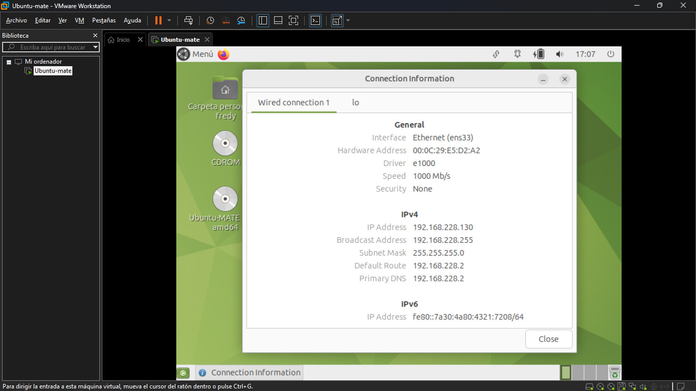
*Figura 7: Captura de Ubuntu MATE mostrando la IP detectada automáticamente.*

---

## 3. Exploración del Virtual Network Editor

### 3.1. Acceso y reconocimiento de los conmutadores predeterminados

El Virtual Network Editor se abrió desde el menú *Edit → Virtual Network Editor* de VMware Workstation Pro. La ventana mostró la lista de conmutadores virtuales configurados en el sistema. Se identificaron los tres conmutadores predeterminados: **VMnet0**, configurado en modo Bridged con el adaptador de red físico del equipo; **VMnet1**, configurado en modo Host-Only con su servidor DHCP habilitado; y **VMnet8**, configurado en modo NAT con su servidor DHCP y el servicio NAT activos. Se registraron las subredes asignadas a cada conmutador.

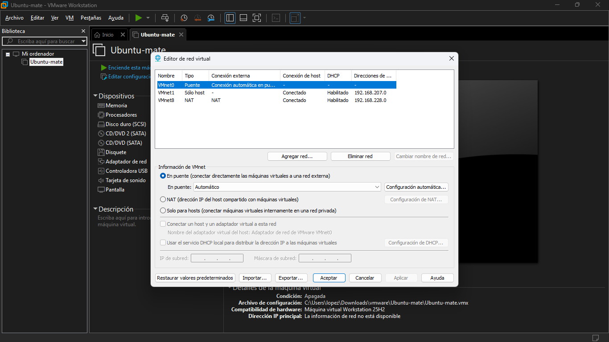
*Figura 8: Captura del Virtual Network Editor mostrando los conmutadores VMnet0, VMnet1 y VMnet8.*

Los datos observados fueron:

| Conmutador | Modo | Subred | DHCP |
|------------|------|--------|------|
| VMnet0 | Bridged | N/A (usa la red física) | No (usa el de la red local) |
| VMnet1 | Host-Only | 192.168.207.0 | Sí |
| VMnet8 | NAT | 192.168.228.0 | Sí |

### 3.2. Identificación de los adaptadores VMnet1 y VMnet8 en Windows

Se abrió el panel *Centro de redes y recursos compartidos* de Windows, accesible desde *Panel de Control → Red e Internet → Centro de redes y recursos compartidos*, y desde allí *Cambiar configuración del adaptador*. En la lista de interfaces de red se identificaron los adaptadores **VMware Network Adapter VMnet1** y **VMware Network Adapter VMnet8**, instalados automáticamente por VMware durante la instalación del software. Se verificaron sus propiedades de TCP/IPv4 para confirmar las direcciones IP que el sistema anfitrión tiene en cada subred virtual.

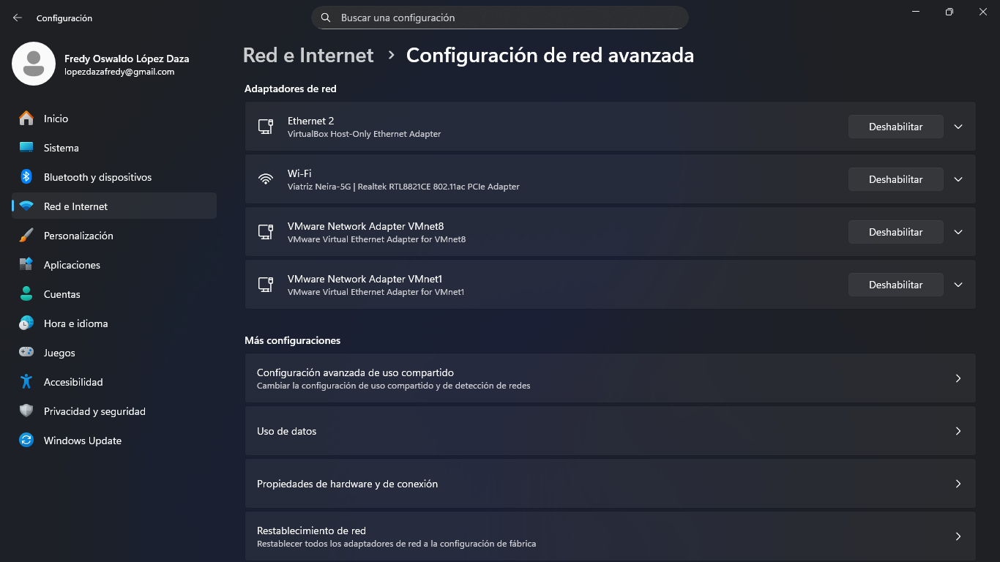
*Figura 9: Captura de la ventana de conexiones de red de Windows mostrando los adaptadores VMnet1 y VMnet8 junto a los adaptadores físicos del equipo.*

---

## 4. Configuración de Red en Modo NAT

### 4.1. Asignación del modo NAT al adaptador de red de la VM

Con la VM apagada, se accedió al editor de hardware virtual desde el menú *VM → Settings*. En el componente *Network Adapter*, se verificó que el modo de red estaba configurado como **NAT** (configuración aplicada por defecto durante la creación de la VM). Se confirmó también que la opción *Connect at power on* estaba habilitada y se aplicó la configuración.

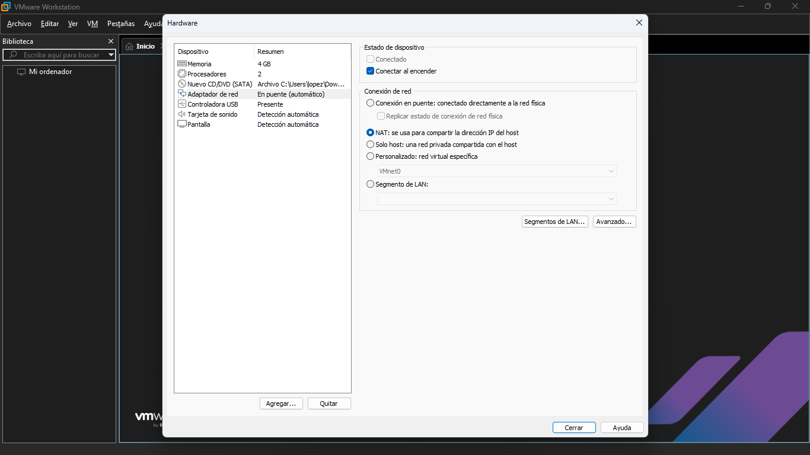
*Figura 10: Captura del editor de hardware virtual con el adaptador de red en modo NAT seleccionado.*

### 4.2. Verificación de la dirección IP asignada por DHCP

Se encendió la VM y se abrió un terminal en Ubuntu MATE. Se ejecutó el comando `ip addr show` para listar las interfaces de red disponibles y verificar la dirección IP asignada:

```bash
ip addr show
```

La salida del comando mostró la interfaz de red virtual (habitualmente denominada `ens33` en VMs de VMware) con una dirección IP en la subred de VMnet8 (192.168.228.130/24), asignada automáticamente por el servidor DHCP de VMware.


*Figura 11: Captura de la terminal de Ubuntu MATE con la salida completa de `ip addr show`, resaltando la IP asignada en la subred NAT.*

Los resultados obtenidos fueron:

- **Interfaz de red:** ens33
- **Dirección IP asignada:** 192.168.228.130
- **Máscara de subred:** 255.255.255.0
- **Red:** Red: 192.168.228.0/24
- **Puerta de enlace (ip route show):** 192.168.228.2

### 4.3. Prueba de conectividad hacia Internet

Para confirmar el funcionamiento del modo NAT, se realizó una prueba de ping hacia el servidor DNS público de Google:

```bash
ping -c 4 8.8.8.8
```

Los cuatro paquetes ICMP recibieron respuesta exitosa, con tiempos de respuesta de 14.0875 ms en promedio, confirmando que la VM tiene conectividad a Internet a través del servicio NAT de VMware.

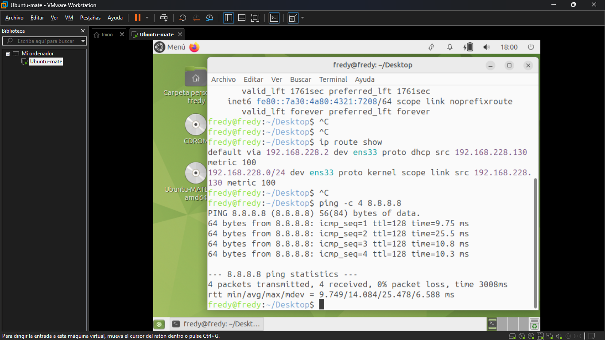
*Figura 12: Captura de la terminal mostrando la salida completa del comando `ping -c 4 8.8.8.8` con las cuatro respuestas recibidas.*

---

## 5. Configuración de Red en Modo Host-Only con IP Estática

### 5.1. Asignación del modo Host-Only al adaptador de red

Con la VM apagada, se accedió nuevamente al editor de hardware virtual y se cambió el modo del *Network Adapter* de NAT a **Host-Only (VMnet1)**. Se guardó la configuración y se encendió la VM.

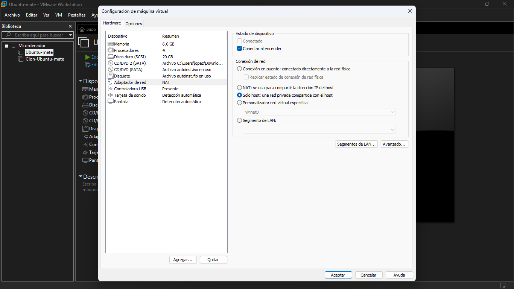
*Figura 13: Captura del editor de hardware virtual con el modo Host-Only seleccionado.*

### 5.2. Configuración de dirección IP estática con nmcli

Una vez arrancada la VM, se abrió un terminal y se verificó la IP asignada por DHCP con `ip addr show`. A continuación, se procedió a configurar una dirección IP estática dentro de la subred de VMnet1, utilizando la herramienta `nmcli` del servicio NetworkManager. Los comandos ejecutados fueron los siguientes:

```bash
# Verificar el nombre de la conexión activa
nmcli connection show

# Configurar IP estática (ajustar los valores según la subred observada en el Virtual Network Editor)
nmcli con mod "Wired connection 1" ipv4.addresses 192.168.207.10/24
nmcli con mod "Wired connection 1" ipv4.gateway 192.168.207.1
nmcli con mod "Wired connection 1" ipv4.dns "8.8.8.8"
nmcli con mod "Wired connection 1" ipv4.method manual
nmcli con up "Wired connection 1"

# Verificar la nueva configuración
ip addr show
```

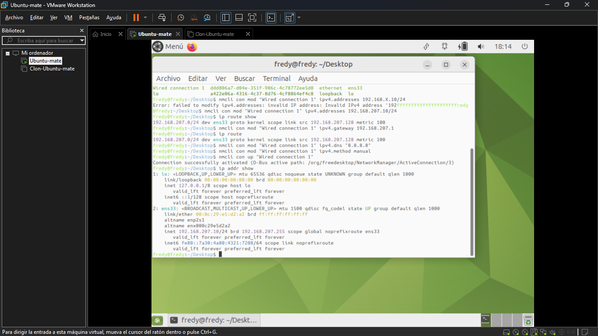
*Figura 14: Captura de la terminal mostrando los comandos `nmcli` ejecutados y la verificación final con `ip addr show`.*

Los valores configurados fueron:

- **Dirección IP estática asignada:** 192.168.207.10
- **Máscara de subred:** 255.255.255.0
- **Puerta de enlace:** 192.168.207.1

### 5.3. Verificación de conectividad con el sistema anfitrión

Para verificar la comunicación entre la VM y el sistema anfitrión a través del modo Host-Only, se ejecutó un ping desde la VM hacia la dirección IP del adaptador VMnet1 del anfitrión (la dirección que se verificó en la sección 3.2):

```bash
ping -c 4 192.168.207.1
```

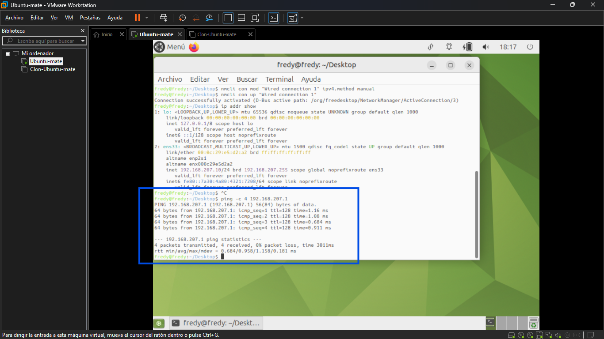
*Figura 15: Captura del ping exitoso desde Ubuntu MATE hacia la dirección del adaptador VMnet1 del anfitrión.*

---

## 6. Configuración de Red en Modo Bridged

### 6.1. Asignación del modo Bridged al adaptador de red

Con la VM apagada, se accedió al editor de hardware virtual y se configuró el *Network Adapter* en modo **Bridged**. Se habilitó la opción de detección automática del adaptador físico puente para que VMware seleccionara automáticamente el adaptador de red activo del equipo anfitrión.

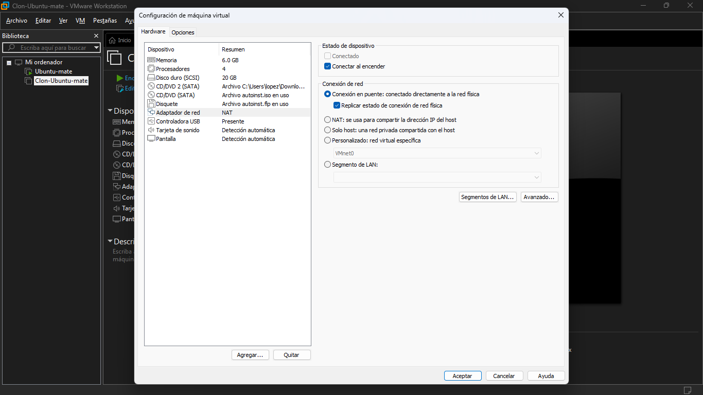
*Figura 16: Captura del editor de hardware virtual con el modo Bridged seleccionado.*

Un paso muy importante que debe hacerse para que todo funcione correctamente es configurar dentro del *Virtual Network Editor*, el VmNet0, no en automático sino explicitamente decirle que adaptador de red, es decir, a donde hacer el puente, pues de esta forma se conecta a la red correcta y empieza a actuar como un dispostivo más en la red con ip propia que es lo que busca el modo bridge.

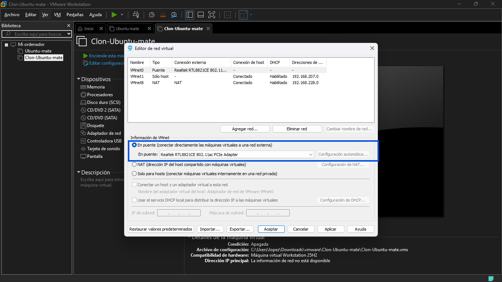
*Figura 16-1: Configuración del adaptador de red para el modo bridge dentro del Virtual Network Editor*

### 6.2. Obtención de dirección IP de la red física

Al encender la VM en modo Bridged, el servidor DHCP de la red física del laboratorio asignó una dirección IP a la VM como si se tratara de un equipo físico independiente conectado a la misma red. Se ejecutó `ip addr show` para verificar la IP asignada y confirmar que pertenecía al rango de la red del laboratorio.

```bash
ip addr show
ip route show
```

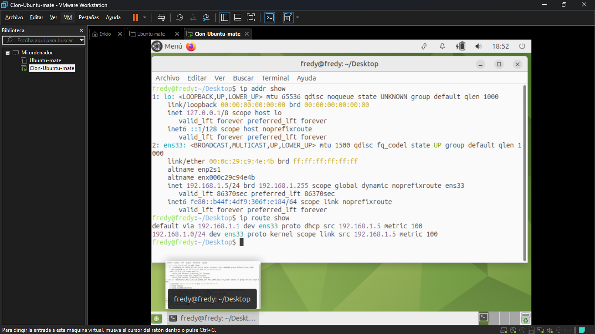
*Figura 17: Captura de la terminal mostrando la IP obtenida en modo Bridged, que debe pertenecer al mismo segmento de red que los equipos físicos del laboratorio.*

Los valores observados fueron:

- **Dirección IP asignada por la red física:** 192.168.1.5
- **Másca de la red:** 255.255.255.0
- **Puerta de enlace de la red física:** 192.168.1.1

### 6.3. Verificación de conectividad con equipos de la red local

Se realizó una prueba de ping hacia la dirección IP del equipo anfitrión en la red física (su ip era la `192.168.1.3`) y hacia la dirección IP de otro equipo del laboratorio para confirmar la integración de la VM en la red local:

```bash
# Ping hacia el equipo anfitrión (IP en la red del laboratorio)
ping -c 4 192.168.1.3

# Ping hacia otro equipo del laboratorio o hacia el gateway
ping -c 4 192.168.1.1
```

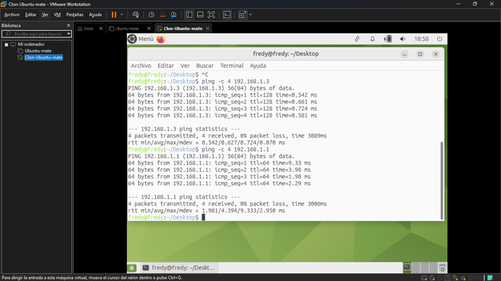
*Figura 18: Captura del ping exitoso hacia otro equipo del laboratorio o el gateway, evidenciando que la VM es visible en la red física.*

---

## 7. Comunicación entre Dos Máquinas Virtuales

Esta sección documenta la práctica central del laboratorio: lograr comunicación directa entre dos máquinas virtuales configuradas en la misma red virtual.

### 7.1. Clonación completa de la VM base

Para crear una segunda máquina virtual sin necesidad de realizar todo el proceso de instalación nuevamente, se utilizó la función de clonación completa de VMware Workstation Pro. Con la VM apagada, se accedió al menú *VM → Manage → Clone*, esto dando click sobre el nombre de la máquina, luego se dirige a Manage o Administrar y luego Clone o clonar. Se seleccionó la opción **Full Clone** para generar una copia completamente independiente.

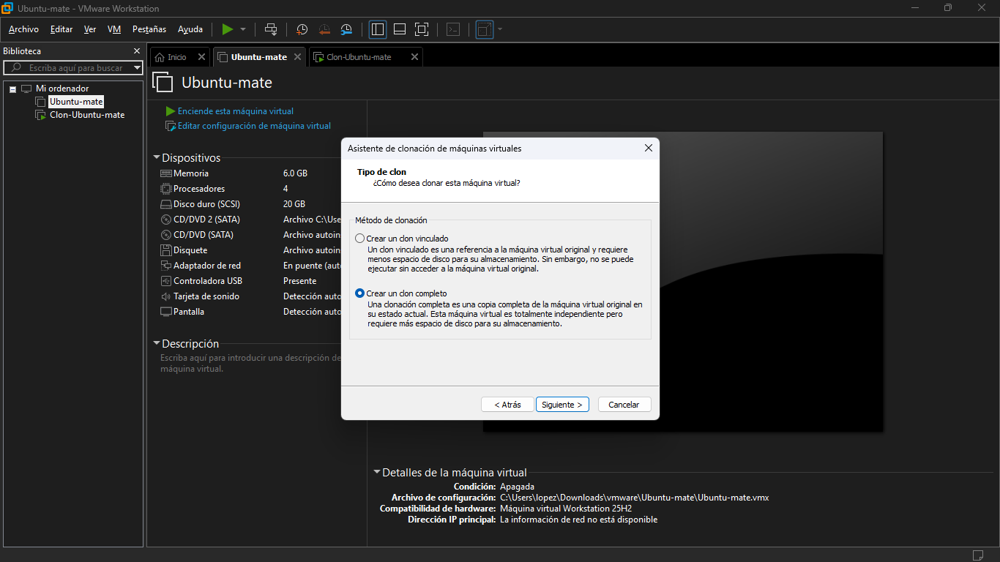
*Figura 19: Captura del asistente de clonación mostrando la selección de "Full Clone" y el nombre asignado a la nueva VM.*

### 7.2. Configuración de IPs en las Maquinas Virtuales y conectividad

Para esta parte es muy importante que se pueda conectar 2 máquinas virtuales por red, pero existen dos formas, la primera creando una red virtual y dejando las máquinas virtuales en el modo de red Host-Only pero deberán estar en el mismo anfitrion y se podrán comunicar fácilmente siguiendo las instrucciones que se mencionan más adelante y la otra forma que es en la que nos vamos a centrar es cuando son máquinas virtuales que están en diferntes equipos y por lo tanto usan bridge para conectarsen dentro de la misma red física, algo muy importante y necesario para desarrollar el proyecto y cómo este laboratorio busca ayudar en la resolución del proyecto es la que más interesa.

A continuación se menciona el paso a paso para lograrlo de ambas formas, pero en la que más se profundizará es en la segunda.

#### 7.2.1. Primer método - Modo Host-Only

Se verificó que ambas VMs tuvieran su adaptador de red configurado en modo **Host-Only (VMnet1)**, de modo que ambas quedaran conectadas al mismo conmutador virtual y pudieran comunicarse entre sí.

Se encendieron ambas VMs simultáneamente. En cada una se configuró una dirección IP estática diferente dentro de la misma subred de VMnet1, siguiendo el procedimiento descrito en la sección 5.2:

**VM1:**

```bash
nmcli con mod "Wired connection 1" ipv4.addresses 192.168.207.10/24
nmcli con mod "Wired connection 1" ipv4.method manual
nmcli con up "Wired connection 1"
```

**VM2:**

```bash
nmcli con mod "Wired connection 1" ipv4.addresses 192.168.207.20/24
nmcli con mod "Wired connection 1" ipv4.method manual
nmcli con up "Wired connection 1"
```

Las IPs configuradas fueron:

| Máquina virtual | Dirección IP | Subred |
|-----------------|-------------|--------|
| VM1 | 192.168.207.10 | 192.168.207.0/24 |
| VM2 | 192.168.207.20 | 192.168.207.0/24 |

Verificación de conectividad VM1 ↔ VM2: Desde la consola de VM1 se ejecutó un ping hacia la dirección IP de VM2, y desde la consola de VM2 se ejecutó un ping hacia VM1, para confirmar la comunicación bidireccional:

```bash
# Desde VM1 hacia VM2
ping -c 4 192.168.207.20

# Desde VM2 hacia VM1
ping -c 4 192.168.207.10
```

En ambos casos, los cuatro paquetes ICMP recibieron respuesta, con tiempos de respuesta similares, confirmando la conectividad directa entre las dos máquinas virtuales a través del conmutador virtual VMnet1.

#### 7.2.2. Segundo método - Modo Bridge

Para esto lo primero que se hizo, fue apagar ambas máquinas cambiar la configuración a modo bridge, como se explico anteriormente, luego asegurarse que dentro del *Virtual Network Editor*, la configuración de bridge tomará el conmutador de red adecuado. Además como se habian asignado IPs estáticas anteriormente fue necesario volver a cambiar la configuración por IPs dinámicas para que fuesen asignadas por el DHCP y además actualizar para que se asignara una IP a cada máquina; para esto se uso los siguientes comandos, en ambas máquinas.
```bash
sudo nmcli con mod "Wired connection 1" ipv4.method auto
sudo nmcli con up "Wired connection 1"
```
Al finalizar esta operación cada máquina tuvo una IP dentro de la red física y se podian comunicar por red con otros dispositivos conectados a la red física. A continuación se muestra las IPs asignadas:

| Máquina virtual | Dirección IP | Red |
|-----------------|-------------|--------|
| VM1 | 192.168.1.7 | 192.168.1.0/24 |
| VM2 | 192.168.1.5 | 192.168.1.0/24 |

Igual que con el método anterior se realizo una prueba de conectividad y se pudo validar que las dos máquinas estaban en la misma red del anfitrion, la red física, a continuación se presenta la evidencia de este paso para ambas máquinas virtuales.
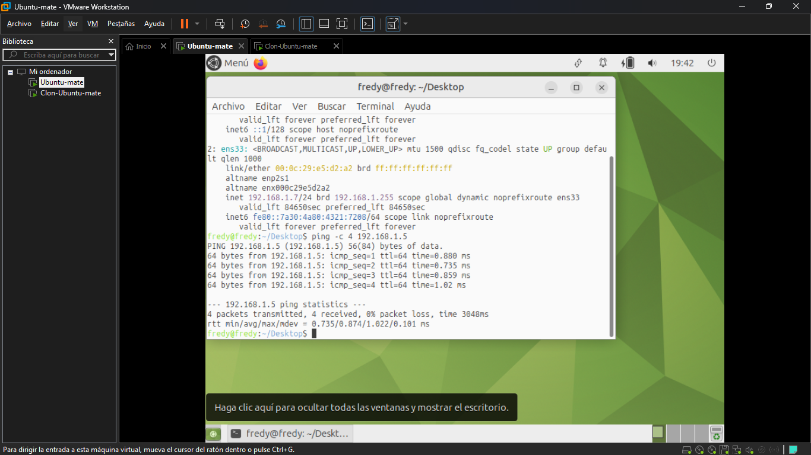
*Figura 20: Validación de conectividad por red física, VM1 -> VM2*

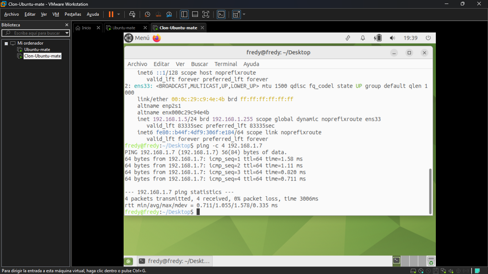
*Figura 20: Validación de conectividad por red física, VM2 -> VM1*

---

## 8. Instantáneas y Gestión del Estado de la VM

### 8.1. Creación de un snapshot antes de modificar la configuración de red

Antes de realizar la práctica de configuración de IP estática de la sección 5, se creó una instantánea (*snapshot*) de la VM con la configuración de red en estado base (IP dinámica por DHCP en modo NAT, VMware Tools instalado). Esto se realizó desde el menú *VM → Snapshot → Take Snapshot*, al que se asignó el nombre **"Base-NAT DHCP-Tools instalados"** y una descripción que indicaba el estado de la VM en ese momento.

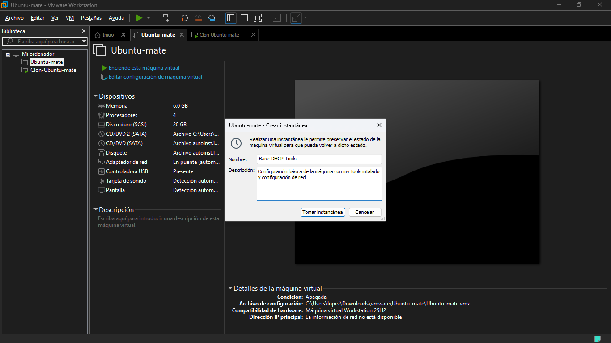
*Figura 21: Captura del Snapshot Manager mostrando la instantánea creada con su nombre y fecha.*

### 8.2. Restauración del snapshot

Para demostrar el proceso de restauración, se aplicó la configuración de IP estática descrita en la sección 5.2 y luego se restauró el snapshot base desde el Snapshot Manager (*VM → Snapshot → Snapshot Manager → Seleccionar snapshot → Go To*). Tras la restauración, la VM regresó exactamente al estado capturado, con la interfaz de red nuevamente en DHCP y sin las configuraciones estáticas aplicadas, lo que confirmó el funcionamiento correcto del mecanismo de instantáneas.

---

## 9. Monitoreo de Actividad de Red

Durante el desarrollo del laboratorio se emplearon las herramientas de diagnóstico de red disponibles en Ubuntu MATE para verificar el estado de la conectividad y monitorear la actividad de las interfaces de red virtuales. Los comandos utilizados y sus funciones fueron los siguientes:

```bash
# Ver interfaces de red, IPs asignadas y estado
ip addr show

# Ver rutas de red activas
ip route show

# Estadísticas de paquetes enviados y recibidos por interfaz
ip -s link

# Listar servicios en escucha con sus puertos y protocolos
ss -tuln

# Verificar resolución de nombres DNS
nslookup google.com

# Trazar la ruta de paquetes hacia un destino
traceroute 8.8.8.8
```

Los resultados más relevantes del monitoreo durante el laboratorio se resumen a continuación: [**completar con los datos reales observados durante la práctica**].

---

## 10. Tabla Resumen de Resultados

La siguiente tabla consolida los resultados de las pruebas de conectividad realizadas en los tres modos de red configurados durante el laboratorio, así como en la prueba de comunicación entre VMs.

| Modo de red | IP de la VM | ¿Ping a Internet? | ¿Ping al anfitrión? | ¿Ping a otra VM? | ¿Visible desde la red física? |
|-------------|-------------|:-----------------:|:-------------------:|:----------------:|:-----------------------------:|
| NAT | 192.168.228.130/24 | Si | Si (por VMnet8) | Solo si en mismo vmnet | No |
| Host-Only | 192.168.207.10/24 | No | Si (por VMnet1) | Si | No |
| Bridged | 192.168.1.5/24 | Si | Si (red física) | Si (si en misma red) | si |
| VM1 ↔ VM2 (Host-Only) | 192.168.27.10/20 | No | Sí | Si | No |

---

## CONCLUSIONES

La diferencia práctica más relevante entre los tres modos de red evaluados radica en el nivel de visibilidad y la dirección del tráfico que cada uno permite. El modo NAT demostró ser la opción que mayor acceso hacia el exterior brinda a la máquina virtual —incluyendo conectividad plena a Internet, confirmada con tiempos de respuesta promedio de 14,09 ms hacia 8.8.8.8—, pero lo hace de forma unidireccional: la VM puede iniciar conexiones hacia afuera, pero ningún equipo externo puede contactarla directamente, puesto que su dirección 192.168.228.130 es privada al conmutador VMnet8 y permanece oculta para la red física. El modo Host-Only, en contraste, eliminó por completo la conectividad con el exterior y circunscribió la comunicación al segmento interno 192.168.207.0/24, compartido únicamente por las VMs y el propio adaptador VMnet1 del anfitrión. El modo Bridged resultó ser el único capaz de integrar la máquina virtual como un nodo más de la red física: al recibir la dirección 192.168.1.5 del servidor DHCP local, la VM fue accesible y pudo comunicarse con cualquier dispositivo de la red 192.168.1.0/24, incluido el equipo anfitrión y el gateway, comportándose a todos los efectos como un equipo físico adicional conectado a la misma infraestructura.

En el contexto del proyecto integrador de la electiva, cada modo de red tiene un rol específico y complementario. El modo Bridged es el mecanismo indispensable para la interoperabilidad entre grupos, dado que permite que las máquinas virtuales administradas con VMware Workstation Pro coexistan en la misma red física que las instancias desplegadas en hipervisores de Tipo 1 como Proxmox Virtual Environment en los equipos de otros grupos; sin este modo, la comunicación entre plataformas heterogéneas simplemente no sería posible. El modo Host-Only, por su parte, es la opción preferible cuando se necesita un canal de comunicación interno, aislado y predecible entre dos o más VMs del mismo anfitrión, por ejemplo para pruebas de servicios sin exponer tráfico a la red del laboratorio. El modo NAT conserva su utilidad para aprovisionar acceso a Internet a una VM durante su configuración inicial —como en la instalación de paquetes con `apt`— sin comprometer la visibilidad de esa VM en la red local.

Durante el desarrollo del laboratorio se presentaron dos dificultades técnicas que enriquecieron la comprensión de la plataforma. La primera fue un error de compatibilidad en uno de los equipos al iniciar la VM, identificado con el código `VERIFY bora\mks\backends\vulkan\vkrSwapchain.c:371`, causado por una incompatibilidad entre el módulo de presentación gráfica de VMware y la versión del sistema anfitrión; se resolvió agregando la directiva `mks.enableVulkanPresentation=FALSE` al archivo `.vmx` de la máquina virtual. La segunda dificultad surgió en el modo Bridged: la configuración automática del conmutador VMnet0 no seleccionó el adaptador físico correcto en todos los equipos, lo que impidió inicialmente que la VM obtuviera una dirección de la red local. La solución consistió en asignar explícitamente el adaptador de red activo dentro del Virtual Network Editor, lo que subraya que la configuración predeterminada de VMnet0 debe verificarse siempre que se trabaje en modo Bridged en equipos con múltiples interfaces de red.

El laboratorio evidenció que los principios de red virtual practicados con VMware Workstation Pro son conceptualmente equivalentes a los empleados en plataformas de virtualización de Tipo 1. La distinción entre un conmutador virtual interno (Host-Only), un conmutador con enrutamiento hacia el exterior (NAT) y un conmutador que extiende la red física (Bridged) es directamente análoga a la diferencia entre una red interna, una red con NAT y un bridge de red en Proxmox VE, respectivamente. Esta equivalencia confirma que el trabajo con un hipervisor de Tipo 2 como VMware Workstation Pro constituye una preparación válida y directamente transferible para la administración de infraestructuras sobre hipervisores de Tipo 1 en entornos productivos, donde los mismos conceptos de segmentación, enrutamiento y visibilidad de red se aplican a mayor escala y con mayor impacto operacional.

---

## REFERENCIAS

[1] VMware, Inc., "VMware Workstation Pro 17 Documentation Overview," *Broadcom Docs*, 2024. [En línea]. Disponible en: https://docs.vmware.com/en/VMware-Workstation-Pro/index.html (accedido: Feb. 2026).

[2] VMware, Inc., "Configuring Virtual Network Components," en *VMware Workstation Pro 17 User's Guide*, cap. Networking, Broadcom Docs, 2024.

[3] Canonical Ltd., "Ubuntu Server Guide — Network Configuration," *Ubuntu Documentation*, 2023. [En línea]. Disponible en: https://ubuntu.com/server/docs/network-configuration (accedido: Feb. 2026).

[4] VMware, Inc., "VMware Tools Documentation," *Broadcom Docs*, 2024. [En línea]. Disponible en: https://docs.vmware.com/en/VMware-Tools/ (accedido: Feb. 2026).

[5] J. Postel, "Internet Control Message Protocol," RFC 792, IETF, Sep. 1981. [En línea]. Disponible en: https://tools.ietf.org/html/rfc792 (accedido: Feb. 2026).