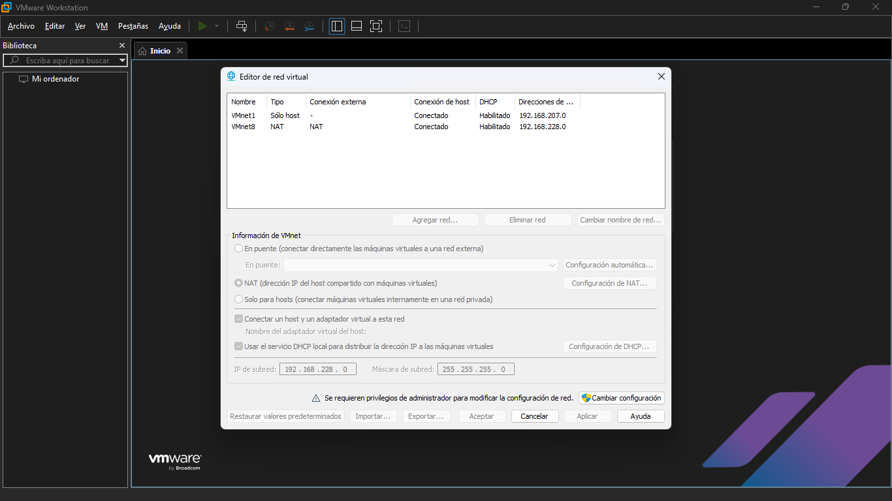
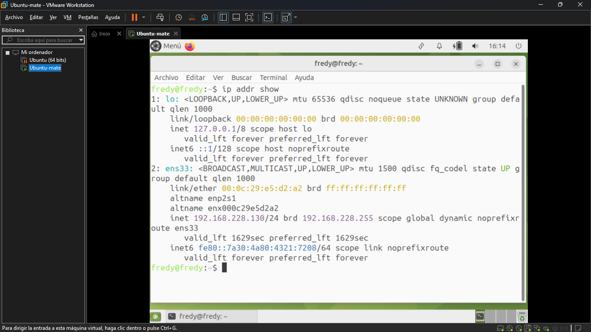
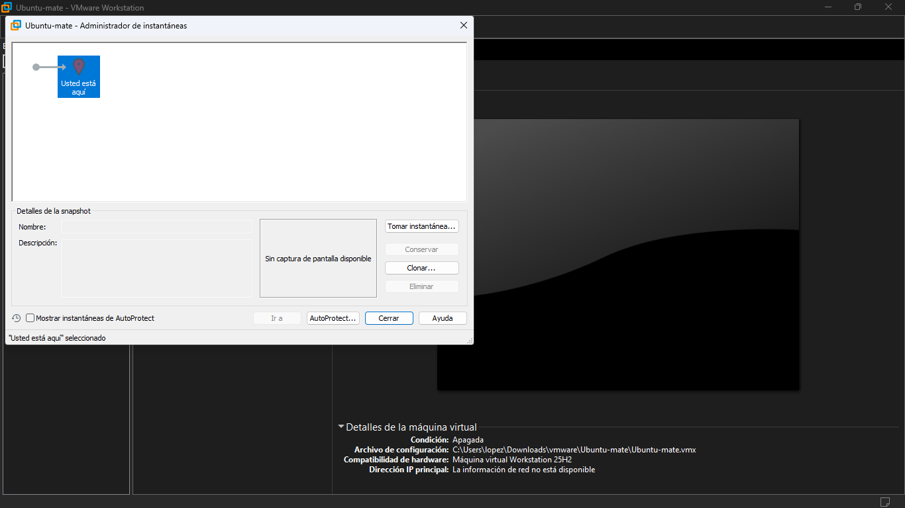

<div align="center">

# VMWARE WORKSTATION PRO

### Marco Teórico — Configuración de Red en Máquinas Virtuales

**Juan Esteban Moreno Gamboa**<br>
**Fredy Oswaldo López Daza**<br>


**Docente:** Frey Alfonso Santamaría Buitrago — Ingeniero de Sistemas

**Universidad Pedagógica y Tecnológica de Colombia**<br>
Facultad de Ingeniería — Escuela de Ingeniería de Sistemas y Computación<br>
Electiva IaaS y Virtualización<br>
Tunja, 2026

</div>

---

## TABLA DE CONTENIDOS

- [LISTA DE FIGURAS](#lista-de-figuras)
- [LISTA DE TABLAS](#lista-de-tablas)
- [INTRODUCCIÓN](#introducción)
- [1. Virtualización de Escritorio: Principios y Plataformas](#1-virtualización-de-escritorio-principios-y-plataformas)
  - [1.1. El concepto de máquina virtual y el hipervisor](#11-el-concepto-de-máquina-virtual-y-el-hipervisor)
  - [1.2. Hipervisores de Tipo 1 y Tipo 2: diferencias y criterios de elección](#12-hipervisores-de-tipo-1-y-tipo-2-diferencias-y-criterios-de-elección)
  - [1.3. VMware Workstation Pro: definición, historia y posicionamiento](#13-vmware-workstation-pro-definición-historia-y-posicionamiento)
  - [1.4. El ecosistema de productos VMware](#14-el-ecosistema-de-productos-vmware)
  - [1.5. Modelo de licenciamiento: gratuito para uso personal desde 2024](#15-modelo-de-licenciamiento-gratuito-para-uso-personal-desde-2024)
- [2. Motor de Virtualización de VMware Workstation Pro](#2-motor-de-virtualización-de-vmware-workstation-pro)
  - [2.1. Virtualización asistida por hardware: Intel VT-x y AMD-V](#21-virtualización-asistida-por-hardware-intel-vt-x-y-amd-v)
  - [2.2. El Virtual Machine Monitor (VMM)](#22-el-virtual-machine-monitor-vmm)
  - [2.3. VMware Tools: integración y rendimiento del sistema invitado](#23-vmware-tools-integración-y-rendimiento-del-sistema-invitado)
- [3. Preparación del Entorno: Instalación y Configuración Inicial](#3-preparación-del-entorno-instalación-y-configuración-inicial)
  - [3.1. Requisitos del sistema anfitrión](#31-requisitos-del-sistema-anfitrión)
  - [3.2. Proceso de instalación en Windows](#32-proceso-de-instalación-en-windows)
  - [3.3. Interfaz de usuario: biblioteca de máquinas virtuales y menús principales](#33-interfaz-de-usuario-biblioteca-de-máquinas-virtuales-y-menús-principales)
- [4. Redes Virtuales en VMware Workstation Pro](#4-redes-virtuales-en-vmware-workstation-pro)
  - [4.1. Arquitectura de red virtual: conmutadores vmnet y el Virtual Network Editor](#41-arquitectura-de-red-virtual-conmutadores-vmnet-y-el-virtual-network-editor)
  - [4.2. Modo Bridged: integración directa con la red física](#42-modo-bridged-integración-directa-con-la-red-física)
  - [4.3. Modo NAT: conectividad a Internet con aislamiento de la red local](#43-modo-nat-conectividad-a-internet-con-aislamiento-de-la-red-local)
  - [4.4. Modo Host-Only: red privada entre máquinas virtuales y anfitrión](#44-modo-host-only-red-privada-entre-máquinas-virtuales-y-anfitrión)
  - [4.5. Redes personalizadas y segmentación avanzada](#45-redes-personalizadas-y-segmentación-avanzada)
  - [4.6. Adaptadores virtuales en el sistema anfitrión: VMnet1 y VMnet8](#46-adaptadores-virtuales-en-el-sistema-anfitrión-vmnet1-y-vmnet8)
  - [4.7. Configuración de direccionamiento IP en el sistema invitado](#47-configuración-de-direccionamiento-ip-en-el-sistema-invitado)
  - [4.8. Verificación de conectividad entre máquinas virtuales](#48-verificación-de-conectividad-entre-máquinas-virtuales)
- [5. Creación y Gestión de Máquinas Virtuales](#5-creación-y-gestión-de-máquinas-virtuales)
  - [5.1. Asistente de nueva máquina virtual](#51-asistente-de-nueva-máquina-virtual)
  - [5.2. Configuración de hardware virtual: CPU, memoria, disco y red](#52-configuración-de-hardware-virtual-cpu-memoria-disco-y-red)
  - [5.3. Clonación de máquinas virtuales](#53-clonación-de-máquinas-virtuales)
  - [5.4. Ciclo de vida de una máquina virtual](#54-ciclo-de-vida-de-una-máquina-virtual)
- [6. Almacenamiento Virtual: El Formato VMDK](#6-almacenamiento-virtual-el-formato-vmdk)
- [7. Instantáneas y Portabilidad](#7-instantáneas-y-portabilidad)
  - [7.1. Snapshots: instantáneas del estado de la máquina virtual](#71-snapshots-instantáneas-del-estado-de-la-máquina-virtual)
  - [7.2. Exportación e importación mediante OVF y OVA](#72-exportación-e-importación-mediante-ovf-y-ova)
- [8. Acceso y Consola de las Máquinas Virtuales](#8-acceso-y-consola-de-las-máquinas-virtuales)
- [9. Monitoreo de Recursos y Actividad de Red](#9-monitoreo-de-recursos-y-actividad-de-red)
- [REFERENCIAS BIBLIOGRÁFICAS](#referencias-bibliográficas)

---

## LISTA DE FIGURAS

| Figura | Descripción |
|--------|-------------|
| Fg. 1  | Interfaz principal de VMware Workstation Pro — biblioteca de máquinas virtuales |
| Fg. 2  | Virtual Network Editor — conmutadores vmnet configurados en el sistema |
| Fg. 3  | Resultado de `ip addr show` en Ubuntu MATE — dirección IP asignada por DHCP en modo NAT |
| Fg. 4  | Configuración del adaptador de red de una VM en modo NAT desde el editor de hardware virtual |
| Fg. 5  | Snapshot Manager |

---

## LISTA DE TABLAS

| Tabla | Descripción |
|-------|-------------|
| Tabla 1 | Comparación entre hipervisores de Tipo 1 y Tipo 2 |
| Tabla 2 | Requisitos mínimos y recomendados del sistema anfitrión para VMware Workstation Pro |
| Tabla 3 | Comparativa de los modos de red disponibles en VMware Workstation Pro |
| Tabla 4 | Comparativa entre disco virtual dinámico y de tamaño fijo en formato VMDK |

---

## INTRODUCCIÓN

La virtualización es uno de los pilares tecnológicos sobre los que se construye la infraestructura de cómputo contemporánea. Desde los centros de datos empresariales hasta los laboratorios académicos, la capacidad de ejecutar múltiples sistemas operativos aislados sobre un único conjunto de hardware físico ha transformado radicalmente la manera en que se diseñan, despliegan y gestionan los entornos de tecnología de la información. En el contexto de la Infraestructura como Servicio (IaaS), la virtualización constituye el mecanismo fundamental que permite abstraer los recursos de cómputo, almacenamiento y red, ofreciéndolos de forma elástica y bajo demanda a los consumidores del servicio.

El presente documento expone el marco conceptual que sustenta el laboratorio práctico del grupo sobre VMware Workstation Pro, un hipervisor de tipo 2 cuyo énfasis en este trabajo recae en la configuración de red de máquinas virtuales para lograr conectividad con otros equipos, tanto físicos como virtuales. A diferencia de los hipervisores bare-metal estudiados por otros grupos de la electiva, VMware Workstation Pro opera sobre un sistema operativo anfitrión convencional, lo que lo hace especialmente apropiado para entornos de aprendizaje donde no se dispone de hardware de servidor dedicado, sin sacrificar por ello la riqueza funcional necesaria para comprender los principios de IaaS. El material se organiza desde los fundamentos de la virtualización y la clasificación de hipervisores, hasta los aspectos específicos de la arquitectura de red virtual de VMware, incluyendo los distintos modos de conectividad disponibles y los procedimientos de configuración aplicados durante el laboratorio.

---

## 1. Virtualización de Escritorio: Principios y Plataformas

### 1.1. El concepto de máquina virtual y el hipervisor

Una máquina virtual (VM) es una abstracción de software que emula el comportamiento de un equipo físico completo, incluyendo procesador, memoria, almacenamiento y dispositivos de entrada y salida, ejecutándose de forma aislada dentro de un sistema de cómputo real [1]. El software encargado de crear y gestionar estas abstracciones recibe el nombre de hipervisor o monitor de máquina virtual (VMM, por sus siglas en inglés). El hipervisor es responsable de arbitrar el acceso de las máquinas virtuales al hardware físico subyacente, garantizando al mismo tiempo el aislamiento entre ellas, de modo que el fallo o la actividad de una VM no afecte a las demás ni al sistema anfitrión.

La formalización matemática de las condiciones que debe cumplir un sistema para ser virtualizable fue propuesta por Gerald J. Popek y Robert P. Goldberg en 1974 en su influyente artículo "Formal requirements for virtualizable third generation architectures" [2]. Según este trabajo, un hipervisor debe proveer tres propiedades esenciales: equivalencia, es decir, que los programas ejecutados dentro de la VM se comporten de manera idéntica a como lo harían en hardware real; eficiencia, garantizando que la mayor parte de las instrucciones del sistema invitado se ejecuten directamente en el hardware sin intervención del hipervisor; y control de recursos, asegurando que el hipervisor mantenga siempre el control sobre los recursos físicos. Estas propiedades continúan siendo el criterio de referencia con el que se evalúa cualquier plataforma de virtualización moderna.

### 1.2. Hipervisores de Tipo 1 y Tipo 2: diferencias y criterios de elección

La industria clasifica los hipervisores en dos categorías principales según el nivel en que operan respecto al hardware y al sistema operativo del equipo físico. Esta clasificación es relevante para el presente laboratorio porque permite situar correctamente a VMware Workstation Pro dentro del panorama de plataformas estudiadas en la electiva.

Los hipervisores de **Tipo 1**, también denominados nativos o bare-metal, se instalan directamente sobre el hardware del servidor, sin la presencia de un sistema operativo anfitrión previo. Al tener acceso privilegiado directo al hardware, ofrecen el mayor rendimiento posible para las cargas de trabajo virtualizadas, junto con un aislamiento de seguridad más estricto, dado que la superficie de ataque se reduce notablemente al no existir un sistema operativo de propósito general por debajo. VMware ESXi, Proxmox Virtual Environment, Microsoft Hyper-V y KVM son ejemplos representativos de esta categoría [3]. Precisamente, Proxmox VE —estudiado por otro grupo de esta electiva— pertenece a esta clasificación.

Los hipervisores de **Tipo 2** u hosted se instalan sobre un sistema operativo anfitrión existente y se ejecutan como una aplicación más dentro de ese entorno. Su acceso al hardware está mediado por el propio sistema operativo del equipo, lo que introduce una capa adicional de software respecto a los hipervisores Tipo 1. Esta arquitectura implica una penalización moderada en rendimiento, pero ofrece ventajas considerables en facilidad de instalación y adopción, dado que puede implementarse sobre cualquier equipo de escritorio o portátil sin necesidad de hardware especializado ni particiones dedicadas. VMware Workstation Pro y Oracle VirtualBox son los representantes más conocidos de esta familia [3].

Tabla 1
*Comparación entre hipervisores de Tipo 1 y Tipo 2*

| Característica | Tipo 1 (Bare Metal) | Tipo 2 (Hosted) |
|----------------|---------------------|-----------------|
| Nivel de instalación | Directamente sobre el hardware físico | Sobre un sistema operativo anfitrión |
| Rendimiento | Máximo — acceso directo al hardware | Moderado — mediado por el SO anfitrión |
| Aislamiento de seguridad | Robusto — superficie de ataque reducida | Dependiente de la seguridad del SO anfitrión |
| Facilidad de instalación | Requiere hardware o partición dedicada | Se instala como una aplicación convencional |
| Entorno de uso típico | Centros de datos y servidores de producción | Desarrollo, laboratorio y formación técnica |
| Ejemplos | VMware ESXi, Proxmox VE, Hyper-V | VMware Workstation Pro, VirtualBox |

*Nota.* Elaboración propia a partir de [3][4].

En el contexto del proyecto integrador de la electiva, el conocimiento de ambas categorías resulta esencial: las VMs configuradas con VMware Workstation Pro en el laboratorio deben poder interactuar con instancias alojadas en plataformas Tipo 1 gestionadas por otros grupos, lo que exige una comprensión sólida de la configuración de red en ambos tipos de entorno.

### 1.3. VMware Workstation Pro: definición, historia y posicionamiento

VMware Workstation Pro es una aplicación de virtualización de escritorio desarrollada por VMware, Inc., empresa adquirida por Broadcom en noviembre de 2023. El producto fue lanzado en mayo de 1999 y se convirtió en el primer software comercial de virtualización para arquitectura x86 disponible en el mercado, marcando el inicio de la era moderna de la virtualización de propósito general [4]. Desde su primera versión, la plataforma ha sido el estándar de referencia en virtualización de escritorio para sistemas Windows y Linux, empleada tanto en la industria como en la academia por su estabilidad, amplitud funcional y fidelidad en la emulación del hardware virtual.

Funcionalmente, VMware Workstation Pro actúa como un intermediario entre el hardware físico del equipo anfitrión y los sistemas operativos invitados que corren dentro de las máquinas virtuales. Cada VM recibe un conjunto de dispositivos virtualizados estandarizados —procesador, memoria, disco, adaptadores de red, controladora USB— cuyo comportamiento es consistente independientemente del hardware real subyacente. Esta característica garantiza la portabilidad de las VMs entre equipos distintos, ya que el archivo de definición de la máquina virtual puede moverse o copiarse a otro equipo con VMware Workstation instalado y ejecutarse sin modificaciones. La plataforma soporta una amplia variedad de sistemas operativos invitados, incluyendo distribuciones Linux, versiones modernas de Windows, sistemas BSD y macOS con restricciones de licencia [1].

En el ámbito de esta práctica de laboratorio, VMware Workstation Pro se emplea para crear máquinas virtuales con Ubuntu MATE, configurar sus adaptadores de red en distintos modos de conectividad y verificar la comunicación entre instancias, lo que constituye la base técnica del proyecto integrador de la electiva.

### 1.4. El ecosistema de productos VMware

VMware, bajo la administración de Broadcom, mantiene una cartera de productos de virtualización que abarca desde el escritorio hasta la nube. Comprender este ecosistema permite situar a VMware Workstation Pro dentro de una jerarquía de herramientas cuyos conceptos son conceptualmente continuos, de modo que las habilidades adquiridas en el laboratorio resultan directamente transferibles a entornos de producción empresarial.

**VMware Workstation Pro** y su equivalente para macOS, **VMware Fusion Pro**, constituyen el extremo accesible del ecosistema, orientado a la virtualización en equipos personales. Fusion Pro incorpora las adaptaciones necesarias para los procesadores Apple Silicon (M1, M2, M3) con arquitectura ARM, manteniendo una experiencia funcional equivalente a la de Workstation Pro en sistemas Intel [5].

**VMware vSphere** es la plataforma de virtualización empresarial de VMware para centros de datos. Su hipervisor **ESXi** es un representante Tipo 1 que se instala directamente sobre servidores físicos; la gestión centralizada de múltiples hosts ESXi se realiza a través de **vCenter Server**, que habilita capacidades como la migración de VMs en vivo entre servidores físicos sin interrupción del servicio (*vMotion*) y la alta disponibilidad automática (*HA*) [6]. Los modos de red virtual aprendidos en Workstation Pro —Bridged, NAT, Host-Only y conmutadores personalizados— son equivalentes conceptuales de los *Standard vSwitch* y *Distributed vSwitch* de vSphere.

**VMware NSX** extiende la virtualización al plano de la red a escala de centro de datos, ofreciendo microsegmentación, firewalls distribuidos implementados en software, y redes superpuestas basadas en VXLAN y GENEVE [6]. Esta jerarquía ilustra que los principios de red virtual practicados con Workstation Pro en el laboratorio son la base conceptual de soluciones de infraestructura que operan a escala corporativa.

### 1.5. Modelo de licenciamiento: gratuito para uso personal desde 2024

En mayo de 2024, Broadcom anunció un cambio significativo en la política de distribución de VMware Workstation Pro y VMware Fusion Pro: ambos productos pasaron a estar disponibles de forma gratuita para uso personal, sin necesidad de licencia de pago [7]. Este cambio eliminó la barrera económica que previamente limitaba su adopción en contextos educativos e individuales. Para uso comercial, VMware Workstation Pro continúa requiriendo una suscripción activa a través del programa de licencias de Broadcom. En el contexto del presente laboratorio académico, la plataforma se utiliza bajo la modalidad de uso personal, lo que permite a los estudiantes instalarlo y practicar en sus propios equipos sin costo adicional.

---

## 2. Motor de Virtualización de VMware Workstation Pro

### 2.1. Virtualización asistida por hardware: Intel VT-x y AMD-V

El funcionamiento eficiente de las máquinas virtuales en VMware Workstation Pro depende de las extensiones de virtualización asistida por hardware presentes en los procesadores modernos: **Intel Virtualization Technology** (Intel VT-x) en los procesadores Intel, y **AMD Virtualization** (AMD-V) en los procesadores AMD. Estas extensiones fueron introducidas con el objetivo de resolver las limitaciones de la arquitectura x86 original para la virtualización eficiente, que Popek y Goldberg habían identificado décadas antes como obstáculos formales a la virtualización completa de esta arquitectura [2].

Ambas extensiones añaden un nuevo nivel de privilegio de ejecución por debajo del modo kernel del sistema operativo, denominado modo raíz (VMX root en la terminología Intel), en el que opera exclusivamente el hipervisor. Los sistemas operativos invitados se ejecutan en modo no raíz (VMX non-root), con acceso a las instrucciones privilegiadas del hardware pero bajo la supervisión y el control del hipervisor, que intercepta únicamente aquellas operaciones que requieren arbitraje. Este mecanismo permite que la gran mayoría de las instrucciones del sistema invitado se ejecuten directamente en el hardware físico sin traducción ni emulación, lo que es el fundamento del rendimiento próximo al nativo que caracteriza a la virtualización moderna [4].


### 2.2. El Virtual Machine Monitor (VMM)

El componente central del motor de virtualización de VMware Workstation Pro es el **Virtual Machine Monitor** (VMM), también conocido como hypervisor kernel. El VMM es el módulo de software que se carga como controlador del sistema operativo anfitrión y asume la responsabilidad de crear el entorno de ejecución aislado para cada máquina virtual. Sus funciones principales incluyen la multiplexación de la CPU física entre todas las VMs activas, garantizando a cada una la ilusión de acceso exclusivo al procesador; la gestión de la memoria física mediante técnicas como el *shadow page table* y el mapeo directo de páginas; y la interceptación y emulación de las instrucciones privilegiadas que los sistemas invitados no pueden ejecutar directamente [4].

Desde la perspectiva del sistema operativo invitado, el VMM presenta un procesador virtual completamente funcional con el conjunto de instrucciones completo de la arquitectura x86-64, junto con un conjunto de dispositivos de hardware virtualizados cuyo comportamiento es consistente y predecible. Esta consistencia es la que permite que el mismo archivo de máquina virtual pueda ejecutarse en diferentes equipos físicos sin necesidad de reinstalar ni reconfigurar el sistema operativo invitado.

### 2.3. VMware Tools: integración y rendimiento del sistema invitado

**VMware Tools** es un paquete de controladores y servicios auxiliares que se instala dentro del sistema operativo invitado para mejorar significativamente la integración entre la VM y el entorno de VMware Workstation Pro [8]. Sin VMware Tools, el sistema invitado opera con controladores genéricos de menor rendimiento y carece de funcionalidades de integración avanzadas. Una vez instalado, el paquete proporciona controladores optimizados para la tarjeta gráfica virtual (que habilitan la aceleración 2D y la resolución de pantalla dinámica), el ratón (que permite que el puntero entre y salga de la ventana de la VM sin necesidad de usar la combinación de teclas de liberación), la red virtual y el almacenamiento. Adicionalmente, VMware Tools habilita la función de portapapeles compartido entre el anfitrión y el invitado, la característica de arrastrar y soltar archivos, y la sincronización del reloj del sistema invitado con el del anfitrión.

---

## 3. Preparación del Entorno: Instalación y Configuración Inicial

El correcto aprovisionamiento del entorno de trabajo es el punto de partida para cualquier práctica de laboratorio con VMware Workstation Pro. En esta sección se describen los requisitos de hardware que debe cumplir el equipo anfitrión, el procedimiento de instalación del software y los elementos principales de la interfaz de usuario que el operador utilizará durante toda la práctica.

### 3.1. Requisitos del sistema anfitrión

VMware Workstation Pro establece requisitos de hardware que el equipo anfitrión debe cumplir para garantizar el funcionamiento correcto de las máquinas virtuales. El requisito más crítico es la presencia de un procesador de 64 bits con las extensiones de virtualización asistida por hardware habilitadas en la BIOS/UEFI, tal como se describió en la sección anterior. Sin este requisito, no es posible ejecutar sistemas operativos invitados de 64 bits ni aprovechar el rendimiento nativo de la plataforma [1].

Tabla 2
*Requisitos mínimos y recomendados del sistema anfitrión*

| Componente | Requisito mínimo |
|------------|------------------|
| Procesador | CPU 64 bits con Intel VT-x o AMD-V habilitado
| Memoria RAM | 4 GB totales en el sistema
| Espacio en disco | 1,5 GB para la instalación del software |
| Sistema operativo anfitrión | Windows 10 de 64 bits |
| Resolución de pantalla | 1024 × 768 píxeles |
| Virtualización en BIOS/UEFI | Intel VT-x o AMD-V activo |

*Nota.* Elaboración propia a partir de [1][9].

### 3.2. Proceso de instalación en Windows

La instalación de VMware Workstation Pro sobre Windows es un proceso convencional que no difiere sustancialmente de la instalación de cualquier otra aplicación de escritorio. El instalador se descarga desde el portal oficial de Broadcom en formato ejecutable (.exe) y se ejecuta con privilegios de administrador [1]. Durante el asistente de instalación, el usuario puede seleccionar la ruta de instalación del software, la ubicación predeterminada donde se almacenarán los archivos de las máquinas virtuales, y si desea añadir iconos en el escritorio y en el menú de inicio. Una vez completada la instalación, el sistema operativo anfitrión cargará automáticamente los módulos del kernel de VMware (vmmon y vmnet) que son responsables, respectivamente, del monitor de máquina virtual y de los conmutadores de red virtuales. Esto también creará los adaptadores de red virtuales VMnet1 (Host-Only) y VMnet8 (NAT) como nuevas interfaces de red en el sistema operativo anfitrión, que serán fundamentales para los modos de red del laboratorio.


*Figura 1: Interfaz principal de VMware Workstation Pro — biblioteca de máquinas virtuales*

### 3.3. Interfaz de usuario: biblioteca de máquinas virtuales y menús principales

La interfaz gráfica de VMware Workstation Pro se organiza en torno a tres elementos principales. El panel izquierdo, denominado **biblioteca de máquinas virtuales**, enumera todas las VMs registradas en la aplicación y permite acceder a su estado, configuración y consola con un solo clic. El panel central es el área de trabajo principal: cuando ninguna VM está seleccionada muestra la pantalla de inicio con accesos directos para crear o abrir una VM; cuando una VM está seleccionada y apagada, muestra un resumen de su hardware y estado; y cuando una VM está en ejecución, muestra su consola activa. La barra de menús superior y la barra de herramientas contextual proporcionan acceso a todas las operaciones de gestión de VMs, el Virtual Network Editor, las preferencias globales de la aplicación y la ayuda en línea [10].

---

## 4. Redes Virtuales en VMware Workstation Pro

La configuración de red constituye el núcleo técnico del presente laboratorio y la competencia central que los estudiantes deben demostrar en la sustentación. VMware Workstation Pro implementa una infraestructura de red virtual completa y flexible que permite simular topologías de red diversas sobre un único equipo físico. La comprensión de esta infraestructura es, además, directamente transferible a conceptos de red virtual empleados en plataformas empresariales como VMware vSphere.

### 4.1. Arquitectura de red virtual: conmutadores vmnet y el Virtual Network Editor

El elemento fundamental de la arquitectura de red en VMware Workstation Pro es el **conmutador virtual** (virtual switch), identificado internamente con la nomenclatura **vmnet** seguida de un número. Un conmutador vmnet funciona de manera análoga a un switch Ethernet físico: conecta entre sí todos los adaptadores de red virtuales que estén asignados a él, permitiendo la comunicación a nivel de capa 2 (Ethernet) entre las VMs y el sistema anfitrión [11].

Por defecto, VMware Workstation Pro crea tres conmutadores virtuales al instalarse: **VMnet0**, que implementa el modo Bridged conectando directamente las VMs a la red física del anfitrión; **VMnet1**, que implementa el modo Host-Only para una red privada sin acceso al exterior; y **VMnet8**, que implementa el modo NAT con un servicio de traducción de direcciones para el acceso a Internet. Adicionalmente, el usuario puede crear hasta diez conmutadores personalizados (VMnet2 a VMnet7, VMnet9) para construir topologías de red más complejas y segmentadas [11].

La herramienta de administración de estos conmutadores es el **Virtual Network Editor** (accesible desde el menú *Edit → Virtual Network Editor* en Windows). Este panel permite crear, eliminar y configurar conmutadores vmnet, definir si cuentan con servidor DHCP propio, establecer el rango de subred que asignarán y administrar la configuración del servicio NAT [11].


*Figura 2: Virtual Network Editor — conmutadores vmnet configurados en el sistema*

### 4.2. Modo Bridged: integración directa con la red física

El modo **Bridged** (red en puente) es el modo de red que ofrece la mayor integración de la máquina virtual con la infraestructura de red física del entorno. En este modo, el adaptador de red virtual de la VM se conecta a VMnet0, que actúa como un puente de capa 2 entre el adaptador de red físico del equipo anfitrión y la VM. El resultado es que la máquina virtual aparece en la red física como si fuera un equipo físico independiente y adicional: obtiene su propia dirección IP del servidor DHCP de la red local, puede ser contactada directamente desde cualquier otro equipo de esa red, y puede acceder a todos los recursos disponibles en ella, incluyendo Internet y otros servidores [11].

Esta modalidad es la más adecuada cuando se necesita que la VM sea visible y accesible desde la red física, por ejemplo para exponer servicios, participar en pruebas de red con otros equipos del laboratorio o simular un nuevo servidor en la infraestructura existente. La condición para que funcione correctamente es que haya un servidor DHCP disponible en la red física, o bien que se configure manualmente una dirección IP estática en la VM dentro del rango de la red local.


### 4.3. Modo NAT: conectividad a Internet con aislamiento de la red local

El modo **NAT** (*Network Address Translation* — traducción de direcciones de red) proporciona acceso a Internet y a recursos externos de red a la máquina virtual, pero manteniéndola oculta e inaccesible desde la red física del entorno. En este modo, el adaptador virtual de la VM se conecta a VMnet8, que incluye un servicio DHCP propio y un servicio NAT integrado. La VM obtiene una dirección IP privada dentro de la subred de VMnet8 (por defecto 192.168.x.0/24), y cuando genera tráfico hacia el exterior, el servicio NAT de VMware reemplaza la dirección IP de origen de la VM por la dirección IP del adaptador de red físico del equipo anfitrión antes de enviar el tráfico a la red local real [11].

Desde el punto de vista de los equipos externos, todo el tráfico originado en la VM parece provenir del equipo anfitrión, lo que garantiza el aislamiento completo de la VM respecto a la red física. Este modo es el más sencillo de configurar —generalmente no requiere ninguna acción adicional del usuario— y el más apropiado cuando el objetivo principal es que la VM tenga acceso a Internet sin necesidad de gestionar direcciones IP en la red local. Para el presente laboratorio, el modo NAT se emplea para proveer acceso a repositorios de software durante la configuración de la VM, mientras que otros modos gestionan la comunicación entre instancias.

### 4.4. Modo Host-Only: red privada entre máquinas virtuales y anfitrión

El modo **Host-Only** (solo anfitrión) crea una red completamente aislada del exterior, en la que solo pueden comunicarse las máquinas virtuales asignadas a VMnet1 y el propio sistema operativo anfitrión a través del adaptador virtual VMnet1 que VMware instala en el sistema de red de Windows. No existe ningún enrutamiento ni puente hacia la red física ni hacia Internet: todo el tráfico permanece dentro de esta red privada virtual [11].

VMnet1 cuenta por defecto con un servidor DHCP propio que asigna automáticamente direcciones IP a las VMs en el rango configurado en el Virtual Network Editor. El sistema anfitrión recibe la primera dirección utilizable de esa subred en su adaptador VMnet1, actuando de forma efectiva como un nodo más de la red privada. Este modo es especialmente útil para configurar comunicación directa entre varias VMs sin exponer el tráfico al exterior, para crear entornos de red aislados para pruebas de seguridad o para establecer el canal de administración de los sistemas invitados desde el anfitrión.

Tabla 3
*Comparativa de los modos de red en VMware Workstation Pro*

| Característica | Bridged | NAT | Host-Only |
|----------------|---------|-----|-----------|
| Conectividad con la red física | Sí — la VM aparece como equipo independiente | Indirecta — mediada por el NAT del anfitrión | No — red aislada del exterior |
| Acceso a Internet | Sí, a través de la red física | Sí, a través del anfitrión | No |
| Visibilidad desde equipos externos | Sí | No | No (solo el anfitrión) |
| Servidor DHCP propio de VMware | No (usa el de la red local) | Sí (VMnet8) | Sí (VMnet1) |
| Conmutador virtual utilizado | VMnet0 | VMnet8 | VMnet1 |
| Caso de uso típico | Integración con la red del laboratorio | Acceso a Internet sin exponer la VM | Comunicación aislada entre VMs y anfitrión |

*Nota.* Elaboración propia a partir de [11].

### 4.5. Redes personalizadas y segmentación avanzada

Además de los tres modos predeterminados, el Virtual Network Editor permite crear conmutadores personalizados numerados del VMnet2 al VMnet9 (con excepción de VMnet3 y VMnet6 que están reservados internamente). Estos conmutadores operan en modo Host-Only por defecto y pueden configurarse con rangos de subred propios y con o sin servidor DHCP. La utilidad de los conmutadores personalizados radica en la posibilidad de construir topologías de red más complejas sobre un único equipo físico: por ejemplo, conectar un grupo de VMs a VMnet3 para simular una DMZ, mientras otro grupo se conecta a VMnet4 para simular una red interna, y una VM adicional que actúe como router virtual tenga adaptadores en ambos segmentos [11].

### 4.6. Adaptadores virtuales en el sistema anfitrión: VMnet1 y VMnet8

Durante la instalación de VMware Workstation Pro, el software registra en el sistema operativo Windows dos nuevos adaptadores de red virtuales que aparecen en el panel *Centro de redes y recursos compartidos* y en el Administrador de dispositivos del sistema anfitrión: el adaptador **VMware Network Adapter VMnet1** y el adaptador **VMware Network Adapter VMnet8** [11]. Estos adaptadores no son interfaces de red físicas sino representaciones lógicas de la conexión del propio sistema anfitrión a los conmutadores virtuales VMnet1 (Host-Only) y VMnet8 (NAT), respectivamente. Su existencia es lo que permite que el sistema anfitrión se comunique directamente con las VMs conectadas a esos modos de red, por ejemplo para acceder por SSH a una VM en modo Host-Only o para transferir archivos mediante SCP.

Las direcciones IP de estos adaptadores son asignadas automáticamente por los servicios DHCP de cada vmnet o pueden configurarse estáticamente desde las propiedades de red de Windows. Verificar estas direcciones es un paso diagnóstico habitual durante las prácticas de red, ya que permiten confirmar en qué subred opera cada modo de conectividad y calcular correctamente los rangos de IP que tendrán las VMs.

### 4.7. Configuración de direccionamiento IP en el sistema invitado

Una vez que la VM está en ejecución y conectada a un conmutador virtual, es necesario configurar el direccionamiento IP dentro del sistema operativo invitado. Ubuntu MATE, la distribución utilizada en el laboratorio, gestiona la red mediante el servicio **NetworkManager**, que puede administrarse tanto desde la interfaz gráfica del applet de red como desde la línea de comandos con la herramienta `nmcli`.

Cuando el adaptador de red de la VM está en modo NAT o Host-Only, el servidor DHCP integrado de VMware asigna automáticamente una dirección IP al iniciarse la interfaz de red del sistema invitado. Para verificar la dirección asignada, se utiliza el comando `ip addr show` o la versión abreviada `ip a`, que listan todas las interfaces de red del sistema con sus direcciones configuradas [12]. Para configurar una **dirección IP estática** —preferible cuando se requiere conectividad predecible entre múltiples VMs durante el laboratorio—, se puede emplear `nmcli` con los parámetros de dirección, máscara de red, puerta de enlace y servidores DNS, o bien utilizar el administrador de red gráfico de Ubuntu MATE. Desde la terminal, la secuencia básica con `nmcli` es la siguiente:

```bash
# Verificar el nombre de la interfaz de red
ip addr show

# Configurar IP estática con nmcli
nmcli con mod "Wired connection 1" ipv4.addresses 192.168.100.10/24
nmcli con mod "Wired connection 1" ipv4.gateway 192.168.100.1
nmcli con mod "Wired connection 1" ipv4.method manual
nmcli con up "Wired connection 1"
```


*Figura 3: Resultado de `ip addr show` en Ubuntu MATE — dirección IP asignada por DHCP en modo NAT*

### 4.8. Verificación de conectividad entre máquinas virtuales

La verificación de conectividad entre dos o más máquinas virtuales es el paso final y más visible del laboratorio de red. El método más directo es el uso del comando `ping`, que envía paquetes ICMP de solicitud de eco y mide el tiempo de respuesta del destino [13]. Si la configuración de red es correcta, el destino responde a cada paquete y `ping` reporta el tiempo de ida y vuelta (RTT) junto con estadísticas de pérdida de paquetes.

Para que la prueba tenga valor diagnóstico, es necesario que ambas VMs estén conectadas al mismo conmutador virtual (mismo vmnet) y que sus direcciones IP pertenezcan a la misma subred. En el modo Bridged, ambas VMs deben haber obtenido IPs del servidor DHCP de la red física o tener IPs estáticas en el rango correcto. En los modos NAT y Host-Only, deben pertenecer a la subred configurada en VMnet8 y VMnet1 respectivamente. Si el ping falla, el diagnóstico se inicia verificando el modo de red de cada VM en el editor de hardware virtual y comprobando las IPs asignadas con `ip addr show`.

```bash
# Verificar la IP de la VM local
ip addr show

# Enviar ping a la IP de otra VM (reemplazar con la IP real)
ping -c 4 192.168.100.20

# Verificar rutas de red configuradas
ip route show
```

---

## 5. Creación y Gestión de Máquinas Virtuales

### 5.1. Asistente de nueva máquina virtual

VMware Workstation Pro ofrece dos modalidades para crear una nueva máquina virtual [14]. La **configuración típica** (*Typical*) es un asistente guiado que reduce el número de decisiones al mínimo necesario: solicita la fuente de instalación del sistema operativo (imagen ISO, disco físico o instalación posterior), detecta automáticamente el tipo de sistema operativo a instalar a partir de la imagen ISO y aplica una configuración de hardware predeterminada optimizada para ese sistema. La **configuración personalizada** (*Custom (Advanced)*) expone todas las opciones disponibles, permitiendo seleccionar la versión de compatibilidad del hardware virtual, el tipo de firmware (BIOS o UEFI), el número y topología de procesadores virtuales, la cantidad de memoria RAM, el tipo y tamaño del disco virtual, y la configuración inicial del adaptador de red, entre otros parámetros [14]. Para el laboratorio con Ubuntu MATE, la configuración típica es suficiente para crear la VM base, que luego se ajustará mediante el editor de hardware virtual antes de arrancar la instalación.

### 5.2. Configuración de hardware virtual: CPU, memoria, disco y red

Una vez creada la VM, todos los parámetros de su hardware virtual pueden modificarse desde el **editor de hardware virtual**, accesible mediante el menú contextual de la VM en la biblioteca o a través de *VM → Settings* [14]. Los parámetros más relevantes para el laboratorio son los siguientes.

La configuración de **procesadores** permite asignar el número de CPU virtuales y el número de núcleos por CPU. Para Ubuntu MATE con carga de trabajo ligera, 2 CPU virtuales con 1 núcleo cada una son suficientes. La **memoria** se configura en megabytes; para Ubuntu MATE se recomienda un mínimo de 2048 MB (2 GB) para una experiencia de uso cómoda, aunque 1024 MB son suficientes para operaciones de red en línea de comandos. El **disco virtual** se crea durante el asistente de nueva VM y en el laboratorio no suele requerir modificaciones posteriores. El componente más relevante para la práctica es el **adaptador de red**: en el editor de hardware virtual aparece listado como *Network Adapter* y su menú desplegable permite seleccionar directamente cualquiera de los modos de red (Bridged, NAT, Host-Only) o cualquier vmnet personalizado, así como habilitar o deshabilitar el adaptador y configurar si debe estar conectado al encender la VM.


*Figura 4: Configuración del adaptador de red de una VM en modo NAT desde el editor de hardware virtual*

### 5.3. Clonación de máquinas virtuales

VMware Workstation Pro ofrece la posibilidad de clonar una VM existente en lugar de crear una nueva desde cero, lo que resulta especialmente útil cuando se necesitan varias instancias del mismo sistema base para el laboratorio [14]. Existen dos modalidades de clonación: el **clon completo** (*full clone*) genera una copia totalmente independiente de la VM original, incluyendo todos sus archivos de disco, sin ninguna dependencia posterior con la VM de origen; el **clon vinculado** (*linked clone*) crea una VM que referencia el disco de la VM original como su base y solo almacena las diferencias producidas desde el momento de la clonación. Los clones vinculados ocupan mucho menos espacio en disco, pero son dependientes de la VM original: si la VM base se mueve o elimina, el clon vinculado deja de funcionar. Para el laboratorio de red, la clonación completa de la VM de Ubuntu MATE instalada y configurada es el método recomendado para generar rápidamente la segunda instancia necesaria en las pruebas de conectividad entre VMs.

### 5.4. Ciclo de vida de una máquina virtual

El ciclo de vida de una VM en VMware Workstation Pro comprende cuatro estados principales que pueden gestionarse desde la barra de herramientas, el menú *VM* o el menú contextual en la biblioteca [10]. El estado **apagado** corresponde a una VM cuyo estado completo en memoria no está guardado; al encenderse, inicia su proceso de arranque normal desde cero. El estado **en ejecución** corresponde a una VM activa con su sistema operativo en marcha. El estado **suspendida** guarda una instantánea del estado completo de la memoria RAM de la VM en disco y la detiene, permitiendo reanudarla exactamente en el punto donde se dejó de forma casi instantánea. El estado **pausada** detiene temporalmente la ejecución de la VM sin guardar su estado en disco; al reanudarla, continúa desde donde estaba. Además, VMware Workstation Pro distingue entre los comandos *Shut Down Guest* (que envía la señal de apagado al sistema operativo invitado para un cierre ordenado con desmontaje de filesystems) y *Power Off* (que corta la alimentación virtual de forma abrupta, equivalente a desenchufar el equipo).

---

## 6. Almacenamiento Virtual: El Formato VMDK

El almacenamiento de las máquinas virtuales en VMware Workstation Pro se implementa mediante archivos con extensión **.vmdk** (*Virtual Machine Disk*), un formato propietario de VMware que emula el comportamiento de un disco duro físico [15]. Desde la perspectiva del sistema operativo invitado, el archivo VMDK se percibe exactamente como un disco físico conectado a una controladora de almacenamiento virtual, sin ninguna diferencia en el comportamiento de los sistemas de archivos ni en las operaciones de lectura y escritura.

Tabla 4
*Comparativa entre disco virtual dinámico y de tamaño fijo en VMDK*

| Característica | Disco dinámico (*Growable*) | Disco de tamaño fijo (*Pre-allocated*) |
|----------------|----------------------------|---------------------------------------|
| Espacio en disco al crearlo | Solo el mínimo necesario para la estructura | Todo el tamaño máximo definido |
| Rendimiento | Ligeramente menor por la gestión de expansión | Mayor — sin operaciones de expansión |
| Flexibilidad de almacenamiento | Alta — crece según se necesite | Baja — espacio reservado íntegramente |
| Caso de uso recomendado | Laboratorio y desarrollo | Producción con cargas de I/O intensivas |

*Nota.* Elaboración propia a partir de [15].

Para el laboratorio, el tipo dinámico es el apropiado, dado que maximiza el uso del espacio disponible en el disco del anfitrión al no reservar espacio no utilizado. Un disco VMDK se puede también dividir en múltiples archivos de 2 GB cada uno para facilitar su portabilidad entre sistemas de archivos FAT32, aunque en el contexto del laboratorio esto raramente es necesario.

---

## 7. Instantáneas y Portabilidad

### 7.1. Snapshots: instantáneas del estado de la máquina virtual

La funcionalidad de **snapshots** o instantáneas permite preservar el estado completo de una máquina virtual —incluyendo el contenido de su memoria RAM, el estado de todos sus dispositivos virtuales y los datos de su disco— en un momento determinado, con la posibilidad de revertir la VM exactamente a ese estado en cualquier momento posterior [16]. Esta capacidad es de un valor práctico considerable durante el laboratorio: antes de realizar una configuración experimental de red, se puede crear un snapshot del estado de la VM con la configuración conocida y funcional; si la configuración produce resultados no deseados, se restaura el snapshot en lugar de reinstalar o reconfigurar todo el sistema desde cero.

VMware Workstation Pro gestiona los snapshots mediante el **Snapshot Manager** (*VM → Snapshot → Snapshot Manager*), que muestra de forma gráfica el árbol de instantáneas de la VM. Las VMs pueden tener múltiples snapshots organizados en un árbol con ramas, de modo que es posible explorar distintas líneas de configuración partiendo de un estado base común. Cada snapshot almacena únicamente las diferencias respecto al estado anterior, lo que mantiene el uso de espacio en disco acotado cuando no hay grandes cambios entre instantáneas.



*Figura 5: Snapshot Manager*

### 7.2. Exportación e importación mediante OVF y OVA

El estándar **OVF** (*Open Virtualization Format*) y su empaquetado comprimido **OVA** (*Open Virtualization Appliance*) son formatos abiertos definidos por el consorcio DMTF para el intercambio de máquinas virtuales entre diferentes plataformas de virtualización [17]. VMware Workstation Pro permite exportar cualquier VM al formato OVF/OVA mediante el menú *File → Export to OVF*, generando un paquete que incluye el descriptor XML de la VM y sus archivos de disco. Este paquete puede importarse en otras instalaciones de VMware Workstation Pro, VMware vSphere u otras plataformas compatibles con el estándar. En el contexto del laboratorio y del proyecto integrador, la exportación en formato OVA puede emplearse para compartir una VM configurada entre los miembros del grupo o para distribuir la VM base a otros grupos para pruebas de interoperabilidad.

---

## 8. Acceso y Consola de las Máquinas Virtuales

La principal modalidad de interacción con el sistema operativo invitado en VMware Workstation Pro es la **consola integrada** en la ventana de la aplicación. Cuando una VM está en ejecución, el panel central muestra en tiempo real la pantalla del sistema invitado, y el usuario puede interactuar con ella mediante teclado y ratón haciendo clic dentro del área de la consola [10]. Al hacer clic en la consola, el teclado y el ratón quedan capturados por la VM; para liberarlos de nuevo al sistema anfitrión se emplea la combinación de teclas `Ctrl+Alt`. La vista puede expandirse a pantalla completa mediante *View → Full Screen* o la combinación `Ctrl+Alt+Enter`, lo que resulta especialmente apropiado durante la sustentación del laboratorio para mostrar el trabajo realizado sin distracciones del escritorio anfitrión.

Una vez que el sistema invitado tiene instalado un servidor SSH y el adaptador de red está en modo Host-Only o NAT, es posible acceder a la VM desde la terminal del sistema anfitrión mediante un cliente SSH. Esta modalidad de acceso ofrece ventajas durante las prácticas de configuración de red: permite abrir múltiples sesiones de terminal simultáneas hacia la misma VM, copiar y pegar comandos complejos de configuración, y emplear herramientas de transferencia de archivos como `scp`. Para habilitar el servidor SSH en Ubuntu MATE, basta con instalar el paquete `openssh-server` mediante `sudo apt install openssh-server` y verificar que el servicio está activo con `systemctl status ssh`. La dirección IP a la que conectarse es la que se obtiene de `ip addr show` dentro de la consola de VMware.

---

## 9. Monitoreo de Recursos y Actividad de Red

VMware Workstation Pro incorpora indicadores básicos de rendimiento en la barra de estado inferior de la ventana de cada VM en ejecución, donde se visualizan en tiempo real el porcentaje de uso de la CPU virtual asignada, el consumo de memoria RAM y el estado del adaptador de red, con contadores de bytes enviados y recibidos [10]. La pestaña *Summary* de cada VM en la biblioteca complementa esta información con un resumen del hardware configurado y, si VMware Tools está instalado, la dirección IP activa del sistema invitado.

Para un análisis más detallado de la actividad de red, es necesario recurrir a las herramientas del sistema operativo invitado. En Ubuntu MATE, el comando `ip -s link` muestra estadísticas de paquetes enviados, recibidos y errores por interfaz; `ss -tuln` enumera los sockets de red activos y los servicios en escucha con sus puertos; y `ping`, además de su función básica de verificación de conectividad, proporciona estadísticas de latencia y pérdida de paquetes que son diagnósticamente relevantes durante las prácticas de configuración de red. La combinación de las métricas del anfitrión con las del sistema invitado ofrece una perspectiva completa del comportamiento del tráfico en cada modo de red virtual, lo que es esencial para diagnosticar problemas de conectividad y verificar que la topología de red implementada funciona según lo esperado.

---

## REFERENCIAS BIBLIOGRÁFICAS

[1] VMware, Inc., "VMware Workstation Pro 17 Documentation Overview," *Broadcom Docs*, 2024. [En línea]. Disponible en: https://docs.vmware.com/en/VMware-Workstation-Pro/index.html (accedido: Feb. 2026).

[2] G. J. Popek y R. P. Goldberg, "Formal requirements for virtualizable third generation architectures," *Communications of the ACM*, vol. 17, n.º 7, pp. 412–421, Jul. 1974. doi: https://doi.org/10.1145/361011.361073.

[3] M. Portnoy, *Virtualization Essentials*, 2.ª ed. Indianapolis: Sybex / John Wiley & Sons, 2016.

[4] VMware, Inc., "Understanding Full Virtualization, Paravirtualization, and Hardware Assist," *VMware White Paper*, 2007. [En línea]. Disponible en: https://www.vmware.com/content/dam/digitalmarketing/vmware/en/pdf/techpaper/VMware_paravirtualization.pdf (accedido: Feb. 2026).

[5] VMware, Inc., "VMware Fusion Pro Documentation Overview," *Broadcom Docs*, 2024. [En línea]. Disponible en: https://docs.vmware.com/en/VMware-Fusion/index.html (accedido: Feb. 2026).

[6] VMware, Inc., "VMware vSphere 8 Documentation," *Broadcom Docs*, 2024. [En línea]. Disponible en: https://docs.vmware.com/en/VMware-vSphere/ (accedido: Feb. 2026).

[7] Broadcom, "VMware Workstation Pro and Fusion Pro Now Free for All Users," *Broadcom Blog*, May. 2024. [En línea]. Disponible en: https://blogs.vmware.com/workstation/2024/05/vmware-workstation-pro-now-available-free-for-personal-use.html (accedido: Feb. 2026).

[8] VMware, Inc., "VMware Tools Documentation," *Broadcom Docs*, 2024. [En línea]. Disponible en: https://docs.vmware.com/en/VMware-Tools/ (accedido: Feb. 2026).

[9] VMware, Inc., "System Requirements for VMware Workstation Pro 17," *Broadcom Docs*, 2024. [En línea]. Disponible en: https://docs.vmware.com/en/VMware-Workstation-Pro/17/com.vmware.ws.using.doc/GUID-7D36E0F1-7800-4B38-83D0-F26F3E20BC5A.html (accedido: Feb. 2026).

[10] VMware, Inc., "Navigating the VMware Workstation Pro Interface," en *VMware Workstation Pro 17 User's Guide*, Broadcom Docs, 2024.

[11] VMware, Inc., "Configuring Virtual Network Components," en *VMware Workstation Pro 17 User's Guide*, cap. Networking, Broadcom Docs, 2024.

[12] Canonical Ltd., "Ubuntu Server Guide — Network Configuration," *Ubuntu Documentation*, 2023. [En línea]. Disponible en: https://ubuntu.com/server/docs/network-configuration (accedido: Feb. 2026).

[13] J. Postel, "Internet Control Message Protocol," RFC 792, IETF, Sep. 1981. [En línea]. Disponible en: https://tools.ietf.org/html/rfc792 (accedido: Feb. 2026).

[14] VMware, Inc., "Creating a New Virtual Machine," en *VMware Workstation Pro 17 User's Guide*, Broadcom Docs, 2024.

[15] VMware, Inc., "Virtual Disk Format 5.0 Technical Note," *VMware Technical Resources*, 2020. [En línea]. Disponible en: https://www.vmware.com/support/developer/vddk/vmdk_50_technote.pdf (accedido: Feb. 2026).

[16] VMware, Inc., "Taking and Restoring Snapshots," en *VMware Workstation Pro 17 User's Guide*, Broadcom Docs, 2024.

[17] DMTF, "Open Virtualization Format (OVF) Specification," DSP0243 v2.2.0, DMTF Standards, 2020. [En línea]. Disponible en: https://www.dmtf.org/standards/ovf (accedido: Feb. 2026).